#  写在前面的话
- 本内容旨在提供一个数据科学，人工智能基本入门简明教程
- 入门简明教程的含义是重在基本操作，没有理论讲解
- 本系列教程还包括Numpy和pandas，详情请红宝书网站查阅
- 学习方法：
    - 本文有配套视频课程，详见[北京图灵学院官网](http://www.tulingxueyuan.com)
    - 按照本文或者视频，自己使用jupyter notebook 手动敲击代码后推敲结果
    - 本文配套Jupyter Notebook格式文档参见[麦扣网](www.mycode.wang)
    - 本文严重参考(抄袭)《Python数据科学手册》


# 1. Matplotlib绘图简介

- 建立在Numpy数组基础上的多平台数据可视化库
- 最初设计用来完善SciPy生态
- 良好的操作系统兼容性和图形显示底层接口兼容性
- 功能强大，设置灵活


## 1.1 图形样式

图形的风格可以设定，所有图形，可以通过`plt.style.use('classic')`
设置图形样式，在1.5版本以前只能使用经典风格，新版本会有不同的风格设置。

## 1.2 不同环境的使用

不同环境中使用Matplotlib可能稍有不同，需要注意:

### i.  脚本中使用

在脚本中使用，并不能自动显示图形，需要使用`plt.show()`明确让Matplotlib把图形显示出来，否则不会看到图形。

### ii. IPython shell

在IPython shell中使用画图，需要使用魔法命令`%matplotlib`, 在以后的画图命令中，会自动显示出需要画的图形。

### iii. Jupyter Notebook

在Jupyter Notebook中一般也需要使用魔法函数，但是相应魔法函数有两个：
- `%matplotlib inline`: 在Notebook中启动静态图形
- `%matplotlib notebook`：在Notebook中启动交互式图形

使用以上两个魔法函数，理论上不需要在使用show函数强制显示图形，但在实践过程中，可能出现不显示的情况，此时建议使用
show显示图像。


## 1.3 图像的保存

经常需要保存产生的图像以备使用，
如果使用的是交互式显示图形，可以直接点击保存按钮来保存图形，在所有代码中，都可以使用savefig函数来保存函数。


## 1.4 两种不同的画图接口

Matplotlib支持两类画图接口：
- MATLAB风格接口：此类接口的特点是有状态的(Stateful），使用方便，对MATLAB用户友好，此类接口在pyplot中
- 面向对象接口：面向对象方式，处理复杂图形比较方便，能力相对比较强

此两种风格接口比较相似，容易混淆，我们在使用中，经常会混用。

# 2.  图形简单绘制

绘制图形基本函数是plot, 这个函数的工作原理大概是分别取x，y的值，然后取到坐标（x，y）后对不同的连续点进行连线，这样就形成了一条连续的线，如果适当调整各个点直接的跨度，就可以看到一条平滑曲线。 

## 2.1 绘制简单图形
需要画如下简单线形图，我们需要创建一个图形fig和一个坐标轴ax。
- fig：figure(plt.Figure)是一个能容纳各种坐标轴，图形，文字和标签的容器。
- ax：axes（plt.Axes）是一个带有刻度和标签的矩形，最终会包含各种可视化元素

在图形绘制中，y=f(x）类函数的显示可以看做是最简单的图形，我们来尝试.


```python
# 绘制 y=f（x）方程的图形

# 图形显示方式
%matplotlib inline
import matplotlib.pyplot as plt
import numpy as np

# 图形显示风格
plt.style.use('seaborn-whitegrid')
 
#创建fig和ax
fig = plt.figure()
ax = plt.axes()


x = np.linspace(0, 10, 100)
# 显示sin函数图形
plt.plot(x, np.sin(x))
#显示cos函数图形
plt.plot(x, np.cos(x))

```


    [<matplotlib.lines.Line2D at 0x7fe669654cc0>]


## 2.2 调整图形风格

通过选用相应的参数，可以调整图形绘制线条的特征，比如颜色，风格等。  
图形颜色值可以支持多种定义风格，常见的包括：
- 使用名称： color='red'
- 颜色代码： 采用rgbcmyk格式， color=’g'
- 范围在0-1的灰度值： color=‘0.85’
- 十六进制： RGB模式， clolor=’#FFDD45‘
- RGB元素，范围0-1：color=（0.5， 0.2， 0.9）
- HTML颜色名称：color=’chartreuse‘


```python
# 不同颜色的线条
plt.plot(x, np.sin(x-1), color='black')
plt.plot(x, np.sin(x-2), color='y')
plt.plot(x, np.sin(x-3), color='0.65')
plt.plot(x, np.sin(x-4), color='#FF0000')
plt.plot(x, np.sin(x-5), color=(0.2, 1.0, 1.0))
plt.plot(x, np.sin(x-6), color='chartreuse')

```


    [<matplotlib.lines.Line2D at 0x7fe66949ff28>]


同样，使用linestyle参数可以定制图形中线的特征，常用的linestyle值为：
- solic： 实现，会用 `-`做简写
- dashed：虚线，用`--`做简写
- dashdot：点划线， 用`-.`简写
- dotted：实心点线， 用`：`简写

这几个是比较常用的，所有类型可以通过内置文档进行查看。


```python
# 不同颜色的线条
plt.plot(x, np.sin(x-1), linestyle='solid', color='black')
plt.plot(x, np.sin(x-2),linestyle='--', color='y')
plt.plot(x, np.sin(x-3), linestyle='dashdot',color='0.65')
plt.plot(x, np.sin(x-4), linestyle=':',color='#FF0000')
 
```


    [<matplotlib.lines.Line2D at 0x7fe669478748>]


linestyle和color可以组合在一起使用更简洁的表示形式，plot函数提供了一个非关键字参数可以让我们使用组合简写：


```python
# 使用组合简写

plt.plot(x, x+0, '-r')
plt.plot(x, x+1, '--g')
plt.plot(x, x+2, '-.b')
plt.plot(x, x+3, ':c')
 
```


    [<matplotlib.lines.Line2D at 0x7fe6693a7550>]


## 2.3 调整坐标轴

### i.  xlim和ylim
Matplotlib会自动为图形调整坐标轴上下限，但有时候也需要自定义调整，常用的调整方法是：
- plt.xlim： x轴
- plt.ylim: y轴

通过xlim和ylim可以调整x轴y轴的上下限，需要说明的是，这两个函数只是简单的把坐标轴数据改成两个参数之间的值就可以，它并不关心真正设置的值，比如可以设置逆序。


```python
# 手动设置坐标轴
# 考虑到x的取值，我们得到了一个很丑很不协调的sin
plt.plot(x, np.sin(x))

plt.xlim(-5,10)
plt.ylim(-3,5)
```


    (-3, 5)


### ii. axis函数

axis函数可以更灵活更强大的设置坐标轴信息， 可以传入`[xmin, xmax, ymin, ymax]`来设置x，y轴的四个值，也还可以设置坐标轴的风格，比如：

- tight：把图形设置成紧凑模式，即坐标按照图形内容自动收紧坐标轴，不留下空白区域。
- equal：图形显示分辨率为1:1    


```python
# 手动设置坐标轴

plt.plot(x, np.cos(x))
plt.axis([-5,10,-3,5])
```


    [-5, 10, -3, 5]


```python
# 让图形自动紧凑
# 图形空白自动去掉
plt.plot(x, np.cos(x))
plt.axis('tight')
```


    (0.0, 10.0, -0.9999471661761239, 1.0)


```python
# 让图形自动紧凑
# 显示分辨率1:1
plt.plot(x, np.cos(x))
plt.axis('equal')
```


    (0.0, 10.0, -1.0, 1.0)


## 2.4 设置图形标签

在对图形进行设置的时候，可能需要一些文字性信息，此类信息主要包含：
- 图形标题：plt.title
- 坐标轴标题: plt.xlabel, plt.ylabel
- 简易图例: plt.legend

对此类信息的设置，中文可能会出现乱码，需要对jupyter Notebook进行单独设置。

### i. 简单标签和title设置


```python
# 设置sin图形标签

plt.plot(x, np.sin(x ))
plt.title("sin Function")
plt.xlabel("X-Value")
plt.ylabel("Y-Value")
```


    Text(0,0.5,'Y-Value')


### ii. 简单图例设置

通过legend可以设置图例，同时通过参数的调整可以细腻的设置图例的位置，形式等。

常见的参数为：
- loc: 图例位置
- frameon:是否带边框
- framealpha: 颜色透明
- shadow: 阴影


```python
#使用面向对象的方法画图

x = np.linspace(0, 10, 50)

fig, ax = plt.subplots()

ax.plot(x, np.sin(x ), color='red', label="SIN")
ax.plot(x, np.cos(x ), color='blue', label="COS")

#全部使用默认
ax.legend()
```


    <matplotlib.legend.Legend at 0x7fe65abe54e0>


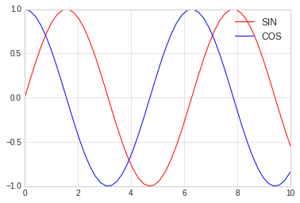


```python
#使用面向对象的方法画图

x = np.linspace(0, 10, 50)

fig, ax = plt.subplots()

ax.plot(x, np.sin(x ), color='red', label="SIN")
ax.plot(x, np.cos(x ), color='blue', label="COS")

#更改位置，添加边框
ax.legend(loc='upper left', frameon=True)
```


    <matplotlib.legend.Legend at 0x7fe65ab9ca58>


```python
#使用面向对象的方法画图

x = np.linspace(0, 10, 50)

fig, ax = plt.subplots()

ax.plot(x, np.sin(x ), color='red', label="SIN")
ax.plot(x, np.cos(x ), color='blue', label="COS")

#更改位置，添加边框
ax.legend(loc='upper left', frameon=True, shadow=True, framealpha=0.2)
```


    <matplotlib.legend.Legend at 0x7fe65a834da0>


### iii. 选择图例显示的元素

选择图例显示元素一般有两种方法：
- 通过设置图形的label属性，不设置的不显示
- 通过给legend传递需要显示的图形，不传递的不显示


```python
# 有时候可能我们并不想把所有线条的图例都显示出来，此时可以选择图例显示的元素

x = np.linspace(0, 10, 50)

fig, ax = plt.subplots()

sin_line  = ax.plot(x, np.sin(x ), color='red', label="SIN")
cos_line = ax.plot(x, np.cos(x ), color='blue', label="COS")

#明确把需要添加图例的线条放入legend作为参数
#没有添加的不显示
ax.legend(cos_line, loc='upper left', frameon=True, shadow=True, framealpha=0.2)
```


    <matplotlib.legend.Legend at 0x7fe65a6f97f0>


```python
# 有时候可能我们并不想把所有线条的图例都显示出来，此时可以选择图例显示的元素

x = np.linspace(0, 10, 50)

fig, ax = plt.subplots()

#默认legend只显示有label的线条，没有的不显示
sin_line  = ax.plot(x, np.sin(x ), color='red', label="SIN")
cos_line = ax.plot(x, np.cos(x ), color='blue')

#只有一个具有label参数，没有的就不显示
ax.legend(loc='upper left', frameon=True, shadow=True, framealpha=0.2)
```


    <matplotlib.legend.Legend at 0x7fe65a64df98>


### iv. 图例中显示不同尺寸


```python
# scatter用来画散点图
# 我们将在后面章节中讲述

rng = np.random.RandomState(0)
x = rng.randn(100)
y = rng.randn(100)

colors = rng.rand(100)
sizes = 1000 * rng.rand(100)

# 设定横轴坐标的范围
plt.xlim(-3, 6)
#画散点图
plt.scatter(x, y, c=colors, s=sizes, alpha=0.4, cmap='viridis')

#显示颜色条
plt.colorbar()

#画图例散点图
for a in [0.1, 0.3, 0.5, 0.7, 0.9]:
    plt.scatter([], [], c='red', alpha=0.5, s=a*300, label="{} Label".format(a))

#画图例文字  
plt.legend(scatterpoints=1, frameon=False, labelspacing=1, title='Random Value')

```


    <matplotlib.legend.Legend at 0x7fe659c3dba8>


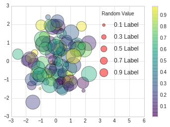


## 2.5 配置颜色条

使用颜色条来配置图例是一种常规操作， 本章讲述颜色条的配置。


```python
# 准备数据
import matplotlib.pyplot as plt
import numpy as np

plt.style.use('classic')
%matplotlib inline
```

### i. 简单颜色条配置


```python
x = np.linspace(0,10, 1000)
I = np.sin(x) * np.cos(x[:, np.newaxis])


plt.imshow(I)
plt.colorbar()
```


    <matplotlib.colorbar.Colorbar at 0x7f387a03ca58>


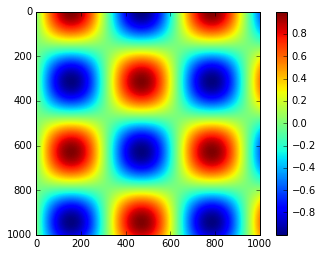


### ii. 配置颜色条

可以通过cmap参数为图形设置颜色条的配置方案, 所有配色方案都在
plt.cm命名空间里，可以直接通过 `plt.cm.<TAB>`查看。


选择合理的配色方案能让实行示例清晰明了，常见的配色方案有：
- 顺序配色方案： 由一组连续的颜色构成的方案，例如binary或者viridis
- 互逆配色方案： 由两种互补的颜色构成，表示正反两种含义，例如RdBu或者PuOr
- 定性配色方案：随机顺序的一组颜色，例如rainbow或者jet


```python
#使用灰色颜色条
x = np.linspace(0,10, 1000)
I = np.sin(x) * np.cos(x[:, np.newaxis])

plt.imshow(I, cmap='RdBu')
plt.colorbar()
```


    <matplotlib.colorbar.Colorbar at 0x7fe659eca5c0>


### iii. 离散型颜色条

颜色条默认是连续的，可以通过设置配色方案和颜色的区间量来显示离散型颜色条。


```python
#使用灰色颜色条
x = np.linspace(0,10, 1000)
I = np.sin(x) * np.cos(x[:, np.newaxis])

#get_cmap两个参数
# 1. 配色方案
# 2. 颜色多少等分
c = plt.cm.get_cmap("PuOr", 10)
plt.imshow(I, cmap=c)
plt.colorbar()
```


    <matplotlib.colorbar.Colorbar at 0x7fe6595ac5c0>


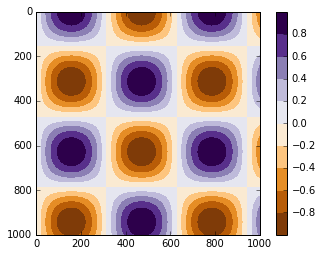


# 3. 散点图

散点图（Scatter Plot）主要是以点为主，数据是不连续的数据，通过设置线的型号为圆点来完成。 
其余的线的形状为：
-    ``'.'``          point marker
-    ``','``          pixel marker
-    ``'o'``          circle marker
-    ``'v'``          triangle_down marker
-    ``'^'``          triangle_up marker
-    ``'<'``          triangle_left marker
-    ``'>'``          triangle_right marker
-    ``'1'``          tri_down marker
-    ``'2'``          tri_up marker
-    ``'3'``          tri_left marker
-    ``'4'``          tri_right marker
-    ``'s'``          square marker
-    ``'p'``          pentagon marker
-    ``'*'``          star marker
-    ``'h'``          hexagon1 marker
-    ``'H'``          hexagon2 marker
-    ``'+'``          plus marker
-    ``'x'``          x marker
-    ``'D'``          diamond marker
-    ``'d'``          thin_diamond marker
-    ``'|'``          vline marker
-    ``'_'``          hline marker

## 3.1  简单散点图


```python
#准备环境
%matplotlib inline
import matplotlib.pyplot as plt
import numpy as np

# 设置风格
plt.style.use('seaborn-whitegrid')

```


```python
x = np.linspace(0,10, 30)
y = np.sin(x)

# 通过设置线型为点来完成三点图的显示
plt.plot(x, y, 'o', color='blue')

```


    [<matplotlib.lines.Line2D at 0x7fe668f962b0>]


## 3.2 其他散点图形状


```python
# 散点图的形状展示

rng = np.random.RandomState(0)

for marker in ['o', '.', 'x', '+', '^', '<', 's', 'd']:
    plt.plot(rng.rand(5), rng.rand(5), marker, label='marker={}'.format(marker))
    plt.legend(numpoints=1)
    plt.xlim(0, 1.8)
```


## 3.3 点线结合的图

在plot的使用中，对线的类型使用直线(-)，圆圈(o)可以画出带有点线结合的图形。


```python
x = np.linspace(0,10, 30)
y = np.sin(x)

# 通过设置线型为点来完成三点图的显示
plt.plot(x, y, '-o', color='blue')
```


    [<matplotlib.lines.Line2D at 0x7fe6692aa748>]


## 3.4 使用plt.scatter画散点图

另一个画散点图的函数是scatter，用法和plot函数类似。

但scatter更加灵活，甚至可以单独控制每个散点不同的属性，例如大小，颜色，边控等。 

相对来讲，对于大量数据的渲染，plot效率要高于scatter。


```python
# scatter案例

rng = np.random.RandomState(0)
x = rng.randn(100)
y = rng.randn(100)

colors = rng.rand(100)
sizes = 1000 * rng.rand(100)
plt.scatter(x, y, c=colors, s=sizes, alpha=0.4, cmap='viridis')

#显示颜色条
plt.colorbar()
```


    <matplotlib.colorbar.Colorbar at 0x7fe668405438>


# 4. 误差线

通过对误差线的绘制，可以直观反映出数据的误差大小等。


```python
#准备环境
%matplotlib inline
import matplotlib.pyplot as plt
import numpy as np

# 设置风格
plt.style.use('seaborn-whitegrid')
```

## 4.1 基本误差线

误差线使用函数plt.errorbar来创建，可以使用不同的参数进行配置。
- ecolor: 控制误差线颜色
- fmt：线型，代码与plot线型控制参数一致


```python
# 基本误差线
x = np.linspace(0, 10, 50)
dy = x * 0.7

y = np.sin(x) + dy

plt.errorbar(x, y, yerr=dy, fmt='.k', ecolor='blue')

```


    <ErrorbarContainer object of 3 artists>


```python
x = np.linspace(0, 10, 50)
dy =  0.7

y = np.sin(x) + dy * np.random.rand(50)

plt.errorbar(x, y, yerr=dy, fmt='o', ecolor='blue', color='red', elinewidth=3, capsize=1)
```


    <ErrorbarContainer object of 3 artists>


## 4.2 连续误差

连续误差表示的是连续量，没有比较合适的简单方法来绘制此类型图形，我们可以使用plt.plot和plt.fill_between来解决，即画出两条区间线表示上下限，然后填充中间区域即可。

下面我们对sin和cos进行简单绘制，绘制后填充两个的中间差值。


```python
 

x = np.linspace(0,10, 50)
ysin = np.sin(x)
ycos = np.cos(x)

plt.plot(x, ysin, color='red')
plt.plot(x, ycos, color='blue')

plt.fill_between(x, ysin, ycos, color='gray', alpha=0.2)
```


    <matplotlib.collections.PolyCollection at 0x7fe65b2eb860>


# 5. 密度图和等高线

等高线或者密度图使我们常用图形， Matplotlib提供三个函数来供我们使用：
- plt.contour: 等高线
- plt.contourf: 自带填充色
- plt.imshow： 显示图形

具体使用请参照下面例子：


```python
#准备环境
%matplotlib inline
import matplotlib.pyplot as plt
import numpy as np

# 设置风格
plt.style.use('seaborn-whitegrid')
```

### i. contour

我们需要一个三维函数，z=f(x,y)来演示等高线图，按照下面函数来进行生成.

contour创建需要至少三个参数，x，y和z，其中x，y我们可以用横轴纵轴表示，z用等高线来表示就可以。当只有一个颜色的图形是，虚线表示负值，实现部分表示正值。

我们使用meshgrid来从一维数据构成二维网格数据。


```python
#函数
def f(x, y):
    return np.sin(x) ** 10 + np.cos(10 + y*x) * np.cos(x)

x = np.linspace(0, 5, 50)
y = np.linspace(0, 5, 40)

#得到网格点矩阵
x, y = np.meshgrid(x, y)

# 计算z轴的值
z = f(x,y)

#绘制图形
plt.contour(x, y, z, colors='green')

```


    <matplotlib.contour.QuadContourSet at 0x7f3879e8cdd8>


```python
#绘制图形
#使用红灰色配色方案
#把值范围50等分
plt.contour(x, y, z, 50, cmap='RdGy')
```


    <matplotlib.contour.QuadContourSet at 0x7fe65b190550>


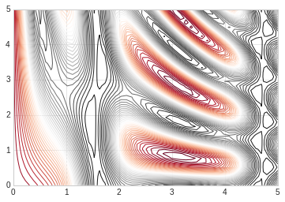


### ii. plt.contourf

以上绘图还是存在比如间隙过大的问题，我们可以用连续的颜色来填充图形，让它变的平滑起来。

plt.contourf可以满足我们的需求，其余填充参数基本同plt.contour一致。


```python
#绘制图形
#平滑过度色彩
plt.contourf(x, y, z, 50, cmap='RdGy')
```


    <matplotlib.contour.QuadContourSet at 0x7fe65b017908>


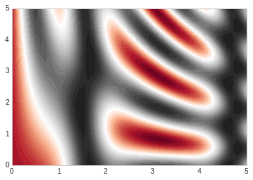


###  iii. plt.imshow

上述图形的显示色彩过度还是不够细腻，因为画上面的图的时候使用的是一条一条的线来绘制，虽然可以通过缩小间隙来让图形更加细腻，但是这样会造成计算资源的过度浪费，Matplotlib为我们提供了imshow来完成渐变图的渲染。


- plt.imshow函数不支持x，y轴的设置，必须通过extent参数来完成设置，extent=[xmin, xmax, ymin, ymax]
- plt.imshow默认以右上角为坐标原点，一般我们使用左下角为坐标原点
- plt.imshow自动调整坐标轴精度来适配数据显示，可以通过plt.axis(aspect='image')来设置x，y的单位


```python
# imshow

plt.imshow(z, extent=[0, 5, 0, 5], origin='lower', cmap='RdGy')

plt.colorbar()
plt.axis(aspect='image')

```


    (0.0, 5.0, 0.0, 5.0)


```python
# 显示等高线的同时通过颜色显示内容

contours = plt.contour(x, y, z, 3, colors="green")
plt.clabel(contours, inline=True, fontsize=8)


plt.imshow(z, extent=[0, 5, 0, 5], origin='lower', cmap='RdGy', alpha=0.2)

plt.colorbar()
plt.axis(aspect='image')

```


    (0.0, 5.0, 0.0, 5.0)


# 6. 频次直方图，数据区间划分和分布密度


```python
#准备环境
%matplotlib inline
import matplotlib.pyplot as plt
import numpy as np

# 设置风格
plt.style.use('seaborn-whitegrid')
```

### i. 频次直方图

使用plt.hist可以画直方图，重要的参数有：
- bins: 画几条方图
- color: 颜色
- alpha: 透明度
- histtype: 图类型


```python
data = np.random.randn(1000)
plt.hist(data)
```


    (array([  9.,  44., 108., 178., 241., 194., 134.,  67.,  20.,   5.]),
     array([-2.83511303, -2.23919796, -1.64328288, -1.04736781, -0.45145274,
             0.14446234,  0.74037741,  1.33629248,  1.93220755,  2.52812263,
             3.1240377 ]),
     <a list of 10 Patch objects>)


```python
plt.hist(data, bins=30, alpha=0.3, histtype='stepfilled', color='steelblue', edgecolor='none')
```


    (array([ 2.,  4.,  3.,  9., 19., 16., 30., 32., 46., 52., 52., 74., 77.,
            87., 77., 83., 66., 45., 56., 41., 37., 29., 18., 20.,  8.,  7.,
             5.,  3.,  0.,  2.]),
     array([-2.83511303, -2.63647467, -2.43783631, -2.23919796, -2.0405596 ,
            -1.84192124, -1.64328288, -1.44464453, -1.24600617, -1.04736781,
            -0.84872945, -0.6500911 , -0.45145274, -0.25281438, -0.05417602,
             0.14446234,  0.34310069,  0.54173905,  0.74037741,  0.93901577,
             1.13765412,  1.33629248,  1.53493084,  1.7335692 ,  1.93220755,
             2.13084591,  2.32948427,  2.52812263,  2.72676099,  2.92539934,
             3.1240377 ]),
     <a list of 1 Patch objects>)


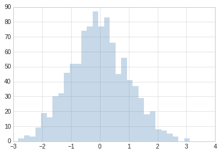


```python
#更复杂的案例

x1 = np.random.normal(0, 0.8, 1000)
x2 = np.random.normal(-2, 1, 1000)
x3 = np.random.normal(3,2, 1000)

kwargs = dict(histtype='stepfilled', alpha=0.3, bins=40)

plt.hist(x1, **kwargs)
plt.hist(x2, **kwargs)
plt.hist(x3, **kwargs)

```


    (array([ 1.,  0.,  1.,  2.,  5.,  2.,  6.,  5.,  8., 11., 17., 23., 26.,
            32., 35., 53., 67., 49., 50., 53., 61., 58., 67., 67., 53., 45.,
            53., 32., 34., 19., 25., 22.,  9.,  2.,  4.,  1.,  0.,  1.,  0.,
             1.]),
     array([-3.90483644, -3.575889  , -3.24694156, -2.91799412, -2.58904668,
            -2.26009924, -1.9311518 , -1.60220436, -1.27325692, -0.94430948,
            -0.61536204, -0.2864146 ,  0.04253285,  0.37148029,  0.70042773,
             1.02937517,  1.35832261,  1.68727005,  2.01621749,  2.34516493,
             2.67411237,  3.00305981,  3.33200725,  3.66095469,  3.98990213,
             4.31884957,  4.64779701,  4.97674445,  5.30569189,  5.63463934,
             5.96358678,  6.29253422,  6.62148166,  6.9504291 ,  7.27937654,
             7.60832398,  7.93727142,  8.26621886,  8.5951663 ,  8.92411374,
             9.25306118]),
     <a list of 1 Patch objects>)


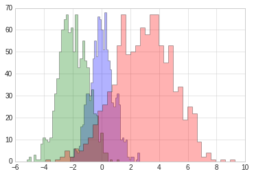


## ii. 二维频次直方图和数据区间划分


```python
# 准备数据

mean = [0, 0]
cov = [[1,1], [1,2]]

# 多元正太分布随机样本抽取
# mean:多元正态分布的维度
# cov:多元正态分布的协方差矩阵，且协方差矩阵必须是对称矩阵和半正定矩阵(形状为(N,N)的二维数组)。
# size: 数组的形状（整数或者由整数构成的元组）。如果该值未给定，则返回单个N维的样本（N恰恰是上面mean的长度）。
x, y = np.random.multivariate_normal(mean, cov, 10000).T
```

###  A. plt.hist2d 

使用plt.hist2d可以画二维直方图。 


```python
plt.hist2d(x, y, bins=30, cmap='Blues')
cb = plt.colorbar()
cb.set_label("counts in bin")
```


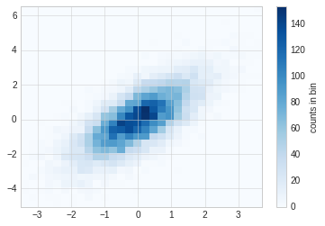


### B. plt.hexbin

hist2d是用的方块组成的图形，还可以使用六边形进行图形分割，需要使用plt.hexbin来完成，用来将图形化成六角形的蜂窝。


```python
plt.hexbin(x, y, gridsize=30, color='red')
cb = plt.colorbar(label="count in bin")
```


### C.  核密度估计

核密度估计(KernelDensityEstimation)是一种常用的评估多维度分布密度的方法，本节主要是对画图函数做一个展示，不详细讲述kde算法。 

kde方法通过不同的平滑带宽长度在拟合函数的准确性和平滑性之间做出一种权衡。


```python
from scipy.stats import gaussian_kde

data = np.vstack([x, y])
kde = gaussian_kde(data)

x = np.linspace(-3.5, 3.5, 40)
y = np.linspace(-6, 6, 40)

x, y = np.meshgrid(x, y)

z = kde.evaluate(np.vstack([x.ravel(), y.ravel()]))

plt.imshow(z.reshape(x.shape), origin='lower', aspect='auto', extent=[-3.5, 3.5, -6, 6], cmap='Blues')

cb = plt.colorbar()
cb.set_label("density")
```


# 7.  多子图

一个界面上有时候需要出现多张图形，这就是多子图。

Matplotlib提供了subplot的概念，用来在较大的图形中同时放置较小的一组坐标轴，这些子图可能是画中画，网格图，或者更复杂的布局形式。 


```python
# 准备数据
%matplotlib inline
import matplotlib.pyplot as plt
import numpy as np

plt.style.use("seaborn-white")
```

## 7.1 手动创建多子图

创建坐标轴最基本的方法是用plt.axes函数， 通过设置不同的坐标参数，可以用来手工创建多子图。

多子图坐标系统可以使用四个元素列表，[left, button, width, height],分别是：
- bottom： 底部坐标
- left：左侧坐标
- width： 宽度
- height： 高度

其中数值的取值范围是0-1， 左下角为0.

[0.5, 0.2, 0.3, 0.4]代表从下面开始50%，从左开始20%的地方是图形的左下角，图形宽高占用30%和40%。


```python
#Matlab风格
ax1 = plt.axes()
ax2 = plt.axes([0.4, 0.2, 0.3, 0.6])

```


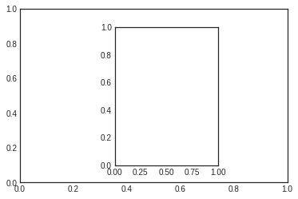


```python
#面向对象格式
fig = plt.figure()

ax1 = fig.add_axes([0.1, 0.5, 0.8, 0.4], xticklabels=[], ylim=(-1.2, 1.2))
ax2 = fig.add_axes([0.1, 0.1, 0.8, 0.4], ylim=(-1.2, 1.2))

x = np.linspace(0, 10)
ax1.plot(np.sin(x))
ax2.plot(np.cos(x))


```


    [<matplotlib.lines.Line2D at 0x7fc8b5147748>]


## 7.2 plt.subplot 建议网格子图

plt.subplot可以创建整齐排列的子图，这个函数有三个整形参数：
- 子图行数
- 子图列数
- 索引值： 索引值从1开始，左上角到右下角逐渐增大


```python
# matlab风格
for i in range(1,7):
    plt.subplot(2,3,i)
    plt.text(0.5, 0.5, str((2,3,i)), fontsize=18, ha='center')
```


```python
#面向对象风格
# plt.subplots_adjust调整子图间隔
# plt.add_subplot

fig = plt.figure()
fig.subplots_adjust(hspace=0.4, wspace=0.4)

for i in range(1,7):
    ax = fig.add_subplot(2,3,i)
    ax.text(0.5, 0.5, str((2,3,i)), fontsize=18, ha='center')
   
```


## 7.3 plt.subplots

一次性创建多个子图，主要四个参数：
- 行数
- 列数
- sharex：是否共享x轴
- sharey：是否共享y轴

下图使用subplots创建2x3个子图，每一行共享y轴，每一列共享x轴。

函数返回值是一个NumPy数组，可以通过下表访问返回的每一个子图。


```python
fig, ax = plt.subplots(2, 3, sharex='col', sharey='row')
```


```python
for i in range(2):
    for j in range(3):
        ax[i,j].text(0.5, 0.5, str((i,j)), fontsize=18, ha='center')

fig
```


## 7.4 plt.GridSpec 

利用plt.GridSpec可以用来实现更复杂的多行多列子图网格。这种画图方式跟前端网页技术的网格思想类似，需先用
plt.GridSpec指出需要总共划分的行和列，然后在具体的画相应子图的时候指出一个子图需要占用的网格。


```python
# 画图方式
# 界面总共分成了2行3列
grid = plt.GridSpec(2, 3, wspace=0.4, hspace=0.3)

# 第一个子图占用了第一个方格
plt.subplot(grid[0,0])
# 第二个子图占用了第一行从第二个后面所有的方格
plt.subplot(grid[0,1:])
# 第三个子图占用了第二行到下标2前的方格
plt.subplot(grid[1,:2])
# 第四个子图占用了第二行第三个方格
plt.subplot(grid[1,2])
```


    <matplotlib.axes._subplots.AxesSubplot at 0x7fc8b4d7db00>


```python
# 正态分布数据的多子图显示

mean = [0,0]
cov = [[1,1], [1,2]]
x, y = np.random.multivariate_normal(mean, cov, 3000).T

#设置坐标轴和网格配置
fig = plt.figure(figsize=(6,6))
grid = plt.GridSpec(4,4, hspace=0.2, wspace=0.2)

main_ax = fig.add_subplot(grid[:-1, 1:])
y_hist = fig.add_subplot(grid[:-1, 0], xticklabels=[], sharey=main_ax)
x_hist = fig.add_subplot(grid[-1, 1:], yticklabels=[], sharex=main_ax)

# 主轴坐标画散点图
main_ax.plot(x, y, 'ok', markersize=3, alpha=0.2)

# 次轴坐标画直方图
x_hist.hist(x, 40, histtype='stepfilled', orientation='vertical', color='red')
x_hist.invert_yaxis()


y_hist.hist(x, 40, histtype='stepfilled', orientation='horizontal', color='blue')
x_hist.invert_xaxis()

```


# 8. 文字与注释

## 8.1 坐标变换和文字位置

通过不同的坐标变换，可以把文字放在不同的位置，文字的坐标变换方法有：
- ax.transData：以数据为基准的坐标变换，直接用数字把坐标表示出来，绝对数据
- ax.transAxes： 以轴为基准，坐标数据表示轴中的相对位置


```python
#环境准备

%matplotlib inline
import matplotlib.pyplot as plt
import numpy as np

plt.style.use("seaborn-whitegrid")
```


```python
fig, ax = plt.subplots(facecolor='lightgray')
ax.axis([0, 10, 0, 10])

ax.text(1, 5, "Data:(1,5)", transform=ax.transData)
ax.text(0.5, 0.1, "Axes:(0.5, 0.1)", transform=ax.transAxes)

```


    Text(0.5,0.1,'Axes:(0.5, 0.1)')


## 8.2 箭头和注释

带箭头的注释一般可以使用两个函数实现：
- plt.arrow: 产生SVG向量图形式的箭头，会随着分辨率改变而变换，不推荐
- plt.annotate: 可以创建文字和箭头

在annotate中，箭头的风格通过arrowprops参数控制，具体参数含义使用的时候可以参考官方文档。


```python
fig, ax = plt.subplots()

x = np.linspace(0, 20, 1000)
ax.plot(x, np.cos(x))
ax.axis('equal')

ax.annotate("local maximum", xy=(6.28, 1), xytext=(10, 4), \
            arrowprops=dict(facecolor='black',shrink=0.05 ))

ax.annotate('local minimum', xy=(5 * np.pi, -1), xytext=(2, -6),\
           arrowprops=dict(arrowstyle="->", connectionstyle='angle3, angleA=0, angleB=-90'))


```


    Text(2,-6,'local minimum')


## 8.3  自定义坐标轴刻度

Matplotlib有默认的坐标轴定位器(locator)和格式生成器(formatter)，基本需求可以满足自定义坐标轴的需求，但是如果需要定制更细腻的表现，需要用到其他的东西。

Matplotlib画图的基本原理是：
- figure对象可以看做是一个图形的总的容器，里面可以包含几个子图
- axes：每个figure包含一个或者多个axes，每个axes有包含其他表示图形内容的对象
- 每个axes有xaxis和yaxis属性，每个属性包含坐标轴的线条，刻度，标签等属性

### i. 主要刻度和次要刻度


通过一下案例，我们发现主要和次要刻度标签都是通过LogLocater对象设置的， 同样格式生成器都是LogFormatterSciNotaion对象。


```python
ax = plt.axes(xscale='log', yscale='log')

print(ax.xaxis.get_major_locator())
print(ax.xaxis.get_minor_locator())

print(ax.xaxis.get_major_formatter())
print(ax.xaxis.get_minor_formatter())
```

    <matplotlib.ticker.LogLocator object at 0x7fd697b69c50>
    <matplotlib.ticker.LogLocator object at 0x7fd697b69a58>
    <matplotlib.ticker.LogFormatterSciNotation object at 0x7fd697b69a90>
    <matplotlib.ticker.LogFormatterSciNotation object at 0x7fd697be4a58>


### ii. 隐藏刻度和标签

有时候我们不需要总显示刻度和标签，可以通过设置空的刻度标签和格式化生成器完成。


```python
# 删除locator和formmater
ax = plt.axes()

ax.plot(np.random.rand(50))

ax.yaxis.set_major_locator(plt.NullLocator())
ax.xaxis.set_major_formatter(plt.NullFormatter())
```


###  iii. 增减刻度数量


```python
# 一下图例使用默认刻度，但显得过于拥挤
fig, ax = plt.subplots(4, 4, sharex=True, sharey=True)
```


使用plt.MaxNLocator可以设置最多需要显示多少刻度，根据设置的刻度数量，Matplotlib会自动为刻度安排恰当的位置。


```python
for axi in ax.flat:
    axi.xaxis.set_major_locator(plt.MaxNLocator(3))
    axi.yaxis.set_major_locator(plt.MaxNLocator(3))
    
fig

```


### iv. 花哨的刻度格式

使用MultipleLocator可以实现把刻度放在你提供的数值的倍数上。


```python
fig, ax = plt.subplots()

x = np.linspace(0, 3*np.pi, 100)

ax.plot(x, np.sin(x), lw=3, label='SIN')
ax.plot(x, np.cos(x), lw=3, label='COS')

#设置网格，图例和坐标轴上下限
ax.grid(True)
ax.legend(frameon=False)
ax.axis('equal')
ax.set_xlim(0, 3*np.pi)
```


    (0, 9.42477796076938)


```python
ax.xaxis.set_major_locator(plt.MultipleLocator(np.pi/2))
ax.xaxis.set_minor_locator(plt.MultipleLocator(np.pi/4))
fig
```


### v. 定位器和格式生成器常用值

定位器和格式生成器常用的取值在plt命名空间内可以找到，下面列出来：

- NullLocator: 无刻度
- FixedLocator：刻度位置固定
- IndexLocator：用索引做定位器，例如x=range(10)
- LinearLocator: 从min到max均匀分布
- LogLocator: 从min到max对数分布
- MultipleLocator： 刻度和范围是基数的倍数
- MaxNLocator： 为最大刻度找到最优位置
- AutoLocator： 以MaxNlocator进行简单配置
- AutoMinorLocator：次要刻度的定位器


格式生成器的取值：
- NullFormatter： 刻度上无标签
- IndexFormatter： 将一组标签设置为字符串
- FixedFormatter： 手动设置标签
- FuncFormatter：自定义函数设置标签
- FormatStrFormatter：为每个刻度设置字符串格式
- ScalarFormatter： 为标量值设置标签
- LogFormatter： 对数坐标轴的默认格式生成器


# 9. 配置文件和样式表

Matplotlib允许手动调整默认样式，如果默认拍照不能满足的情况下，可以手动调整样式。

而对于样式表，每个程序都有一套完整的配色方案，我们可以对起进行修改或者替换，系统给我们提供了很多固定风格的
搭配，如果需要，不建议过多修改配置内容，必要的时候直接替换样式表就好，必要的时候做一些微小改动即可满足需求。

## 9.1  手动配置图形

通过手动配置图形，可以改变图形的刻度，背景等内容，下面例子是对图形配置的一个简单示例。


```python
#设置环境
import matplotlib.pyplot as plt
import numpy as np

plt.style.use('classic')

%matplotlib inline
```


```python
#使用默认配置显示图形
x = np.random.randn(1000)
plt.hist(x)
```


    (array([  1.,   3.,  43., 119., 237., 285., 195.,  92.,  22.,   3.]),
     array([-3.90095153, -3.1706347 , -2.44031787, -1.71000103, -0.9796842 ,
            -0.24936737,  0.48094946,  1.2112663 ,  1.94158313,  2.67189996,
             3.40221679]),
     <a list of 10 Patch objects>)


```python
# 对图形进行各种配置

ax = plt.axes()
ax.set_axisbelow(True)

#被色网格线
plt.grid(color='g', linestyle='solid')

#隐藏坐标的线条
for spine in ax.spines.values():
    spine.set_visible(False)

#隐藏上边和右边的刻度
ax.xaxis.tick_bottom()
ax.yaxis.tick_left()

#弱化刻度和标签
ax.tick_params(colors='green', direction='out')
for tick in ax.get_xticklabels():
    tick.set_color('orange')

for tick in ax.get_yticklabels():
    tick.set_color('orange')

#设置频次直方图轮廓色和填充色
ax.hist(x, edgecolor="#1122FF", color='#998877')
```


    (array([  1.,   3.,  43., 119., 237., 285., 195.,  92.,  22.,   3.]),
     array([-3.90095153, -3.1706347 , -2.44031787, -1.71000103, -0.9796842 ,
            -0.24936737,  0.48094946,  1.2112663 ,  1.94158313,  2.67189996,
             3.40221679]),
     <a list of 10 Patch objects>)


## 9.2 修改默认配置

默认配置在修改的时候需要先把系统默认配置保存，使用完毕后需要还原配置。


```python
#保存默认的配置，修改后需要还原
rc_default = plt.rcParams.copy()

from matplotlib import cycler
colors = cycler('color', ['#777777', '#888888', '#999999', '#AAAAAA', '#BBBBBB', '#CCCCCC'])

plt.rc('axes', facecolor='#EEEEEE', edgecolor='none', \
       axisbelow=True, grid=True, prop_cycle=colors)

plt.rc('grid', color='w', linestyle='solid')
plt.rc('xtick', direction='out', color='gray')
plt.rc('ytick', direction='out', color='gray')
plt.rc('patch', edgecolor='green')
plt.rc('lines', linewidth=2)

plt.hist(x)

```


    (array([  1.,   3.,  43., 119., 237., 285., 195.,  92.,  22.,   3.]),
     array([-3.90095153, -3.1706347 , -2.44031787, -1.71000103, -0.9796842 ,
            -0.24936737,  0.48094946,  1.2112663 ,  1.94158313,  2.67189996,
             3.40221679]),
     <a list of 10 Patch objects>)


```python
for i in range(4):
    plt.plot(np.random.rand(10))
    
plt.rcParams.update(rc_default)
```


## 9.3 样式表

样式表就是系统给提供的完整配置方案。

在style模块里，包含大量样式表可以使用。

使用`plt.style.available`可以得到所有可用的样式：


```
['seaborn-dark', 'tableau-colorblind10', 'fivethirtyeight', 'seaborn-white', 'seaborn-bright', 'seaborn-deep', 'ggplot', 'Solarize_Light2', 'seaborn-colorblind', 'seaborn-darkgrid', 'seaborn-pastel', 'seaborn', 'seaborn-talk', '_classic_test', 'seaborn-notebook', 'dark_background', 'fast', 'seaborn-dark-palette', 'classic', 'grayscale', 'seaborn-poster', 'bmh', 'seaborn-ticks', 'seaborn-whitegrid', 'seaborn-paper', 'seaborn-muted']

```

对样式的使用，可以使用代码`plt.style.use('stylename')`来处理。但这个会改变以后所有的风格，如果需要，建议使用风格上下文管理器来临时更换：

`plt.style.context('stylename')`

通过风格上下文管理器，我们可以临时更换配置方案而不必操心还原等操作，一旦离开上下文管理器的作用范围，则临时上下文管理器就失效。


```python
# 准备数据
def hist_and_lines():
    np.random.seed(0)
    fig, ax = plt.subplots(1,2,figsize=(11,4))
    ax[0].hist(np.random.randn(1000))
    for i in range(3):
        ax[1].plot(np.random.rand(10))
    ax[1].legend(['a', 'b', 'c'], loc='lower left')
```

### i. 默认风格


```python
#还原默认风格
plt.rcParams.update(rc_default)

hist_and_lines()

```


### ii. FiveThirtyEight风格

这个风格是模仿网站FiveThirtyEight。

`http://fivethirtyeight.com`


```python
with plt.style.context('fivethirtyeight'):
    hist_and_lines()
```


### iii. ggplot风格

ggplot是R语言非常流行的可视化工具，ggplot风格就是模仿ggplot工具包。


```python
with plt.style.context('ggplot'):
    hist_and_lines()
```


### iv. bmh风格


```python
with plt.style.context('bmh'):
    hist_and_lines()
```


### v. 黑色背景风格


```python
with plt.style.context("dark_background"):
    hist_and_lines()
```


### vi. 灰度风格


```python
with plt.style.context("grayscale"):
    hist_and_lines()
```


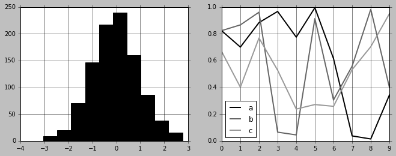


### vii. Seaborn风格


```python
# 导入seaborn库的时候自动导入seaborn风格
import seaborn
hist_and_lines()
```


# 10. 三维图

借助于matplotlib自带的mplot3d包，我们可以实现三维图的绘制。 

我们默认使用魔法函数`matplotlib inline`来进行绘制，但是，如果使用魔法函数`%matplotlib notebook`绘制，画出的图是交互式的，我们可以通过拖动图形来让图形转动。

## 10.1  简单三维坐标的绘制

通过导入mplot3d包，在`plt.axes`中使用projection参数，我们可以采用默认方式绘制一个三维的坐标系。


```python
%matplotlib inline

import numpy as np
import matplotlib.pyplot as plt

from mpl_toolkits import mplot3d

fig = plt.figure()
ax = plt.axes(projection='3d')


```


## 10.2 三维数据的点和线

三维数据主要研究的是`z=f(x,y)`, 如果绘制三维图形，需要有x，y，z，求三个数据然后在相应的点上画点或者连线。

使用的画点或者连线的函数常用的是`ax.plot3d`和`ax.scatter3D`。

为了呈现更好的三维效果，默认散点图会自动改变透明度。


```python
# 画一个螺旋三维线
%matplotlib inline
ax = plt.axes(projection='3d')

#数据准备
z = np.linspace(0,15, 1000)
x = np.sin(z)
y = np.cos(z)

#三维线
ax.plot3D(x, y, z, 'red')

#三维点
zdata = 15 * np.random.random(100)
xdata = np.sin(zdata) + 0.1 * np.random.randn(100)
ydata = np.cos(zdata) + 0.1 * np.random.randn(100)

ax.scatter3D(xdata, ydata, zdata, c=zdata, cmap='Greens')
```


    <mpl_toolkits.mplot3d.art3d.Path3DCollection at 0x7f5014234748>


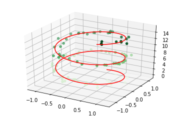


## 10.3 三维等高线

三维图默认的观察视角可能不是最后的，我们可以时候用`ax.view_init`来改变观察视角，两个参数：
- 俯仰角度，即x-y平面的旋转角度
- 方位角度，即沿着z轴顺时针转动角度


```python
def f(x, y):
    return np.sin(np.sqrt(x**2 + y**2))

x = np.linspace(-6, 6, 30)
y = np.linspace(-6, 6, 30)

X, Y = np.meshgrid(x, y)
Z = f(X,Y)

fig = plt.figure()
ax = plt.axes(projection='3d')
ax.contour3D(X, Y, Z, 50)

ax.set_xlabel("X-Axis")
ax.set_ylabel("Y-Axis")
ax.set_zlabel("Z-Axis")

```


    Text(0.5,0,'Z-Axis')


```python
# 上图调整旋转角度为（60， 30）
ax.view_init(60, 30)
fig
```


## 10.4 线框图和曲面图

线框图是由网格做成的可视化三维图。线框图显示的是由线条组成的轮廓，相对来讲，曲面图是有多边形构成的多边形，可以更好的显示图形表面的结构。

如果选择合适的坐标系，利用合适的数据区间，可以产生类似切片的可视化效果。


```python
fig = plt.figure()
ax = plt.axes(projection='3d')
#线框图
ax.plot_wireframe(X, Y, Z, color='red')
ax.set_title('wireframe')
ax.view_init(60, 30)
```


```python
fig = plt.figure()
ax = plt.axes(projection='3d')
#线框图
ax.plot_surface(X, Y, Z, color='green')
ax.set_title('surface')
ax.view_init(60, 30)
```


```python
r = np.linspace(0, 6, 30)
theta = np.linspace(-0.9*np.pi, 0.8*np.pi, 40)

r, theta = np.meshgrid(r, theta)

X = r * np.sin(theta)
Y = r * np.cos(theta)
Z = f(X, Y)

ax = plt.axes(projection='3d')
ax.plot_surface(X, Y, Z, cmap='viridis')

ax.view_init(60,-40)
```


## 10.5  曲面三角剖分

对于一些要求均匀采样的网格数据显得太过严格而不太容易实现的图像，我们可以使用三角剖分(triangulation-based plot)来解决。 


```python
# 随机散点数据组成的图形

theta = 2 * np.pi * np.random.random(1000)
r = 6 * np.random.random(1000)
x = np.ravel(r * np.sin(theta))
y = np.ravel(r * np.cos(theta))
z = f(x, y)

ax = plt.axes(projection='3d')
ax.scatter(x, y, z, c=z, cmap='viridis', linewidth=1)

ax.view_init(60, 30)
```


```python
#随机数据构成三角剖分
ax = plt.axes(projection='3d')
ax.plot_trisurf(x, y, z, cmap='viridis', edgecolor='none')

ax.view_init(60, 30)
```


#  11.  Seaborn做数据可视化

Matplotlib作为数据可视化工具非常强大，但相对来讲，还是有一些缺憾，特别是早期版本，引发问题的根本原因主要是，Matplotlib开发早于Pandas，所以前期版本对Pandas的支持可想而知不会太好，相比较而言，Seaborn作为在Matplotlib基础上发展出来的绘图工具，快速得到使用和的认可。

## 11.1 Seaborn和Matplotlib的对比

同一组数据我们用Seaborn和Matplotlib两种绘图风格来绘图进行对比。


```python
# 准备环境

%matplotlib inline
import matplotlib.pyplot as plt
import numpy as np
import pandas as pd

plt.style.use("classic")

```


```python
# 准备数据
rng = np.random.RandomState(0)
x = np.linspace(0, 10, 500)
y = np.cumsum(rng.randn(500, 6), 0)
#画图
plt.plot(x, y)
plt.legend("ABCDEF", ncol=2, loc='upper left')
```


    <matplotlib.legend.Legend at 0x7f4ff8e5f9e8>


```python
# 上述图用seaborn来实现

import seaborn as sns
sns.set()

plt.plot(x, y)
plt.legend("ABCDEF", ncol=2, loc='upper left')
```


    <matplotlib.legend.Legend at 0x7f50147832b0>


## 11.2  Seaborn图形介绍

Seaborn的主要思想是用高级命令为统计数据探索和统计模型拟合创建各种图形。

### i. 频次直方图，KDE和密度图


```python
# 直方图
data = np.random.multivariate_normal([0, 0], [[5, 2], [2, 2]], size=2000)
data = pd.DataFrame(data, columns=['X', 'Y'])

for col in 'XY':
    plt.hist(data[col], alpha=0.5)
```


```python
# sns.kedplot可以实现KDE变量帆布的平滑估计

for col in 'XY':
    sns.kdeplot(data[col], shade=True)
```

    /sw/ana/lib/python3.7/site-packages/scipy/stats/stats.py:1713: FutureWarning: Using a non-tuple sequence for multidimensional indexing is deprecated; use `arr[tuple(seq)]` instead of `arr[seq]`. In the future this will be interpreted as an array index, `arr[np.array(seq)]`, which will result either in an error or a different result.
      return np.add.reduce(sorted[indexer] * weights, axis=axis) / sumval


```python
# distplot可以让频次直方图和KDE结合起来

sns.distplot(data['X'])
sns.distplot(data['Y'])
```

    /sw/ana/lib/python3.7/site-packages/scipy/stats/stats.py:1713: FutureWarning: Using a non-tuple sequence for multidimensional indexing is deprecated; use `arr[tuple(seq)]` instead of `arr[seq]`. In the future this will be interpreted as an array index, `arr[np.array(seq)]`, which will result either in an error or a different result.
      return np.add.reduce(sorted[indexer] * weights, axis=axis) / sumval


    <matplotlib.axes._subplots.AxesSubplot at 0x7f4ff6c17da0>


```python
# 如果是想kdeplot输入的二维数据，则可以获得二维数据的可视化
sns.kdeplot(data)
```

    /sw/ana/lib/python3.7/site-packages/seaborn/distributions.py:679: UserWarning: Passing a 2D dataset for a bivariate plot is deprecated in favor of kdeplot(x, y), and it will cause an error in future versions. Please update your code.
      warnings.warn(warn_msg, UserWarning)
    /sw/ana/lib/python3.7/site-packages/scipy/stats/stats.py:1713: FutureWarning: Using a non-tuple sequence for multidimensional indexing is deprecated; use `arr[tuple(seq)]` instead of `arr[seq]`. In the future this will be interpreted as an array index, `arr[np.array(seq)]`, which will result either in an error or a different result.
      return np.add.reduce(sorted[indexer] * weights, axis=axis) / sumval


    <matplotlib.axes._subplots.AxesSubplot at 0x7f4ff6b99f28>


```python
# jointplot可以同时看到两个变量的联合分布和单变量的独立分布

with sns.axes_style('white'):
    sns.jointplot('X', 'Y', data, kind='kde')
```

    /sw/ana/lib/python3.7/site-packages/scipy/stats/stats.py:1713: FutureWarning: Using a non-tuple sequence for multidimensional indexing is deprecated; use `arr[tuple(seq)]` instead of `arr[seq]`. In the future this will be interpreted as an array index, `arr[np.array(seq)]`, which will result either in an error or a different result.
      return np.add.reduce(sorted[indexer] * weights, axis=axis) / sumval


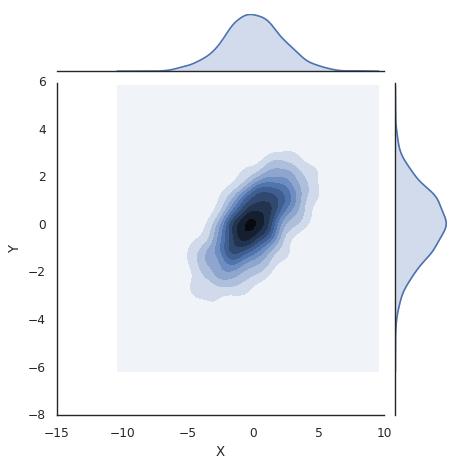


```python
# 向jointplot函数传递一些参数，可以用六边形块代替频次直方图。

with sns.axes_style("white"):
    sns.jointplot('X', 'Y', data, kind='hex')
```

    /sw/ana/lib/python3.7/site-packages/scipy/stats/stats.py:1713: FutureWarning: Using a non-tuple sequence for multidimensional indexing is deprecated; use `arr[tuple(seq)]` instead of `arr[seq]`. In the future this will be interpreted as an array index, `arr[np.array(seq)]`, which will result either in an error or a different result.
      return np.add.reduce(sorted[indexer] * weights, axis=axis) / sumval


### ii. 矩阵图

对多维数据集进行可视化时，需要用到矩阵图（pair plot）来表示变量中任意两个变量的关系，探索多维数据不同维度的相关性。


```python
import seaborn as sns
# 载入鸢尾花数据集
# 鸢尾花数据集研究的是花瓣和花萼的尺寸和鸢尾花品种的关系
# 数据从Github下载，可能需要多试几次才能成功
iris = sns.load_dataset('iris')
iris.head()
```


<div>
<style scoped>
    .dataframe tbody tr th:only-of-type {
        vertical-align: middle;
    }

    .dataframe tbody tr th {
        vertical-align: top;
    }

    .dataframe thead th {
        text-align: right;
    }
</style>
<table border="1" class="dataframe">
  <thead>
    <tr style="text-align: right;">
      <th></th>
      <th>sepal_length</th>
      <th>sepal_width</th>
      <th>petal_length</th>
      <th>petal_width</th>
      <th>species</th>
    </tr>
  </thead>
  <tbody>
    <tr>
      <th>0</th>
      <td>5.1</td>
      <td>3.5</td>
      <td>1.4</td>
      <td>0.2</td>
      <td>setosa</td>
    </tr>
    <tr>
      <th>1</th>
      <td>4.9</td>
      <td>3.0</td>
      <td>1.4</td>
      <td>0.2</td>
      <td>setosa</td>
    </tr>
    <tr>
      <th>2</th>
      <td>4.7</td>
      <td>3.2</td>
      <td>1.3</td>
      <td>0.2</td>
      <td>setosa</td>
    </tr>
    <tr>
      <th>3</th>
      <td>4.6</td>
      <td>3.1</td>
      <td>1.5</td>
      <td>0.2</td>
      <td>setosa</td>
    </tr>
    <tr>
      <th>4</th>
      <td>5.0</td>
      <td>3.6</td>
      <td>1.4</td>
      <td>0.2</td>
      <td>setosa</td>
    </tr>
  </tbody>
</table>
</div>


```python
#展示四个变量的矩阵
sns.pairplot(iris, hue='species', size=2.5)
```

    /sw/ana/lib/python3.7/site-packages/seaborn/axisgrid.py:2065: UserWarning: The `size` parameter has been renamed to `height`; pleaes update your code.
      warnings.warn(msg, UserWarning)
    /sw/ana/lib/python3.7/site-packages/scipy/stats/stats.py:1713: FutureWarning: Using a non-tuple sequence for multidimensional indexing is deprecated; use `arr[tuple(seq)]` instead of `arr[seq]`. In the future this will be interpreted as an array index, `arr[np.array(seq)]`, which will result either in an error or a different result.
      return np.add.reduce(sorted[indexer] * weights, axis=axis) / sumval


    <seaborn.axisgrid.PairGrid at 0x7f385d5cb748>


### iii.  分面频次直方图

借助数据子集的频次直方图观察数据是一种很好的观察方法，下面案例展示的是服务员收取消费的数据。


```python
# 再如数据
# tips数据研究的是服务员小费数量和顾客年龄等之间的关系
tips = sns.load_dataset('tips')
tips.head()
```


<div>
<style scoped>
    .dataframe tbody tr th:only-of-type {
        vertical-align: middle;
    }

    .dataframe tbody tr th {
        vertical-align: top;
    }

    .dataframe thead th {
        text-align: right;
    }
</style>
<table border="1" class="dataframe">
  <thead>
    <tr style="text-align: right;">
      <th></th>
      <th>total_bill</th>
      <th>tip</th>
      <th>sex</th>
      <th>smoker</th>
      <th>day</th>
      <th>time</th>
      <th>size</th>
    </tr>
  </thead>
  <tbody>
    <tr>
      <th>0</th>
      <td>16.99</td>
      <td>1.01</td>
      <td>Female</td>
      <td>No</td>
      <td>Sun</td>
      <td>Dinner</td>
      <td>2</td>
    </tr>
    <tr>
      <th>1</th>
      <td>10.34</td>
      <td>1.66</td>
      <td>Male</td>
      <td>No</td>
      <td>Sun</td>
      <td>Dinner</td>
      <td>3</td>
    </tr>
    <tr>
      <th>2</th>
      <td>21.01</td>
      <td>3.50</td>
      <td>Male</td>
      <td>No</td>
      <td>Sun</td>
      <td>Dinner</td>
      <td>3</td>
    </tr>
    <tr>
      <th>3</th>
      <td>23.68</td>
      <td>3.31</td>
      <td>Male</td>
      <td>No</td>
      <td>Sun</td>
      <td>Dinner</td>
      <td>2</td>
    </tr>
    <tr>
      <th>4</th>
      <td>24.59</td>
      <td>3.61</td>
      <td>Female</td>
      <td>No</td>
      <td>Sun</td>
      <td>Dinner</td>
      <td>4</td>
    </tr>
  </tbody>
</table>
</div>


```python
# 把数量变成百分比
tips['tip_pct'] = 100 * tips['tip'] / tips['total_bill']
grid = sns.FacetGrid(tips, row='sex', col='time', margin_titles=True)
grid.map(plt.hist, 'tip_pct', bins=np.linspace(0, 40, 15))
```


    <seaborn.axisgrid.FacetGrid at 0x7f4ff5bccb38>


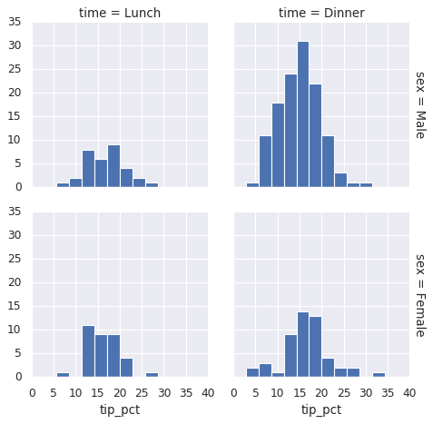


### iv. 因子图

因子图（Factor Plot）也是对数据子集进行可视化的方法，可以用来观察一个参数在另一个参数间隔中的分布情况。


```python
with sns.axes_style(style='ticks'):
    g = sns.factorplot('day', 'total_bill', 'sex', data=tips, kind='box')
    g.set_axis_labels("Day", 'Total_bill')
```

    /sw/ana/lib/python3.7/site-packages/seaborn/categorical.py:3666: UserWarning: The `factorplot` function has been renamed to `catplot`. The original name will be removed in a future release. Please update your code. Note that the default `kind` in `factorplot` (`'point'`) has changed `'strip'` in `catplot`.
      warnings.warn(msg)


### v. 联合分布图

可以用jointplot画出不同数据集的联合分布和各数据样本本身的分布。


```python
#联合分布图
with sns.axes_style("white"):
    sns.jointplot('total_bill', 'tip', data=tips, kind='hex')
```

    /sw/ana/lib/python3.7/site-packages/scipy/stats/stats.py:1713: FutureWarning: Using a non-tuple sequence for multidimensional indexing is deprecated; use `arr[tuple(seq)]` instead of `arr[seq]`. In the future this will be interpreted as an array index, `arr[np.array(seq)]`, which will result either in an error or a different result.
      return np.add.reduce(sorted[indexer] * weights, axis=axis) / sumval


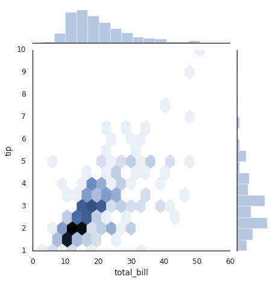


```python
#带回归拟合的联合分布图
#联合分布图自行进行kde和回归
sns.jointplot('total_bill', 'tip', data=tips, kind='reg')
```

    /sw/ana/lib/python3.7/site-packages/scipy/stats/stats.py:1713: FutureWarning: Using a non-tuple sequence for multidimensional indexing is deprecated; use `arr[tuple(seq)]` instead of `arr[seq]`. In the future this will be interpreted as an array index, `arr[np.array(seq)]`, which will result either in an error or a different result.
      return np.add.reduce(sorted[indexer] * weights, axis=axis) / sumval


    <seaborn.axisgrid.JointGrid at 0x7f4ff2f6d5f8>


### vi. 条形图


```python
# 行星观测数据的展示
planets = sns.load_dataset('planets')
planets.head()
```


<div>
<style scoped>
    .dataframe tbody tr th:only-of-type {
        vertical-align: middle;
    }

    .dataframe tbody tr th {
        vertical-align: top;
    }

    .dataframe thead th {
        text-align: right;
    }
</style>
<table border="1" class="dataframe">
  <thead>
    <tr style="text-align: right;">
      <th></th>
      <th>method</th>
      <th>number</th>
      <th>orbital_period</th>
      <th>mass</th>
      <th>distance</th>
      <th>year</th>
    </tr>
  </thead>
  <tbody>
    <tr>
      <th>0</th>
      <td>Radial Velocity</td>
      <td>1</td>
      <td>269.300</td>
      <td>7.10</td>
      <td>77.40</td>
      <td>2006</td>
    </tr>
    <tr>
      <th>1</th>
      <td>Radial Velocity</td>
      <td>1</td>
      <td>874.774</td>
      <td>2.21</td>
      <td>56.95</td>
      <td>2008</td>
    </tr>
    <tr>
      <th>2</th>
      <td>Radial Velocity</td>
      <td>1</td>
      <td>763.000</td>
      <td>2.60</td>
      <td>19.84</td>
      <td>2011</td>
    </tr>
    <tr>
      <th>3</th>
      <td>Radial Velocity</td>
      <td>1</td>
      <td>326.030</td>
      <td>19.40</td>
      <td>110.62</td>
      <td>2007</td>
    </tr>
    <tr>
      <th>4</th>
      <td>Radial Velocity</td>
      <td>1</td>
      <td>516.220</td>
      <td>10.50</td>
      <td>119.47</td>
      <td>2009</td>
    </tr>
  </tbody>
</table>
</div>


```python
with sns.axes_style("white"):
    g = sns.factorplot('year', data=planets, aspect=2, \
                      kind='count', color='steelblue')
    g.set_xticklabels(step=5)
```

    /sw/ana/lib/python3.7/site-packages/seaborn/categorical.py:3666: UserWarning: The `factorplot` function has been renamed to `catplot`. The original name will be removed in a future release. Please update your code. Note that the default `kind` in `factorplot` (`'point'`) has changed `'strip'` in `catplot`.
      warnings.warn(msg)


```python
#对比用不同的方法发现行星数量
with sns.axes_style("white"):
    g = sns.factorplot('year', data=planets, aspect=4.0, \
                      kind='count', hue='method', order=range(2001, 2015))
    g.set_ylabels('Number of Planets Discovered')
```

    /sw/ana/lib/python3.7/site-packages/seaborn/categorical.py:3666: UserWarning: The `factorplot` function has been renamed to `catplot`. The original name will be removed in a future release. Please update your code. Note that the default `kind` in `factorplot` (`'point'`) has changed `'strip'` in `catplot`.
      warnings.warn(msg)


