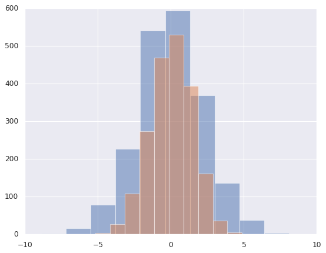
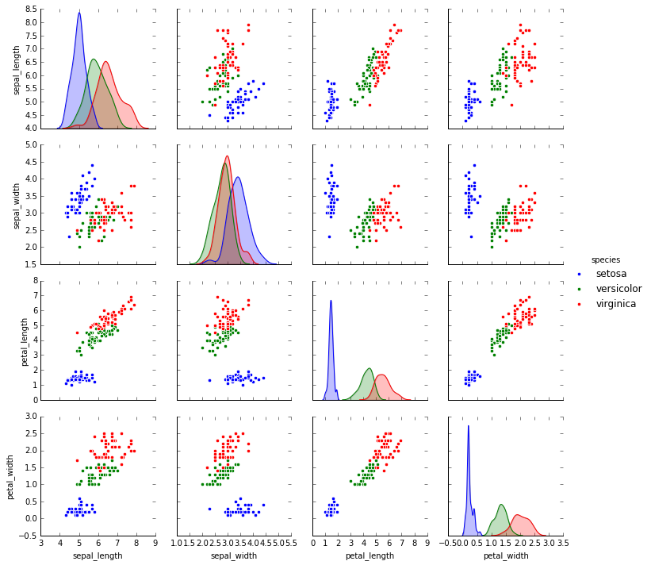
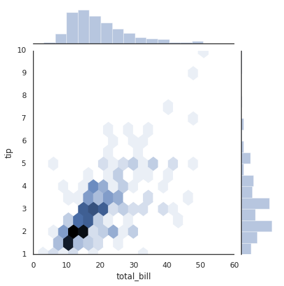
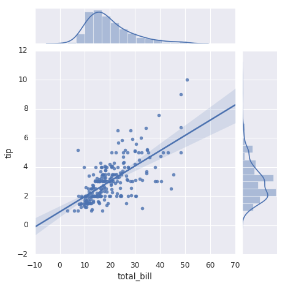
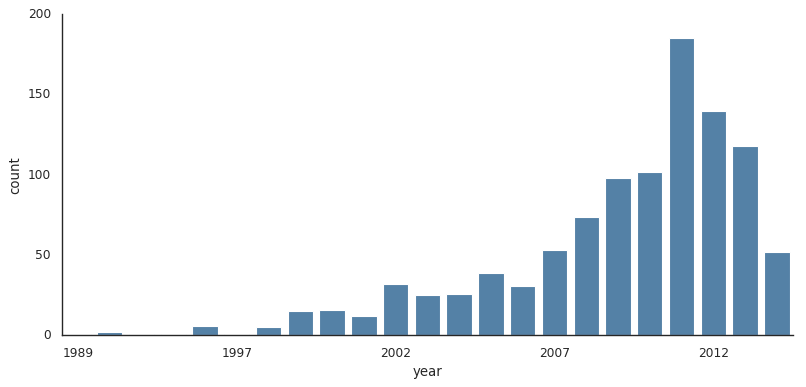

# Seaborn数据可视化

Matplotlib作为数据可视化工具非常强大，但相对来讲，还是有一些缺憾，特别是早期版本，引发问题的根本原因主要是，Matplotlib开发早于Pandas，所以前期版本对Pandas的支持可想而知不会太好，相比较而言，Seaborn作为在Matplotlib基础上发展出来的绘图工具，快速得到使用和的认可。

## Seaborn和Matplotlib的对比

同一组数据我们用Seaborn和Matplotlib两种绘图风格来绘图进行对比。


```python
# 准备环境

%matplotlib inline
import matplotlib.pyplot as plt
import numpy as np
import pandas as pd

plt.style.use("classic")

```


```python
# 准备数据
rng = np.random.RandomState(0)
x = np.linspace(0, 10, 500)
y = np.cumsum(rng.randn(500, 6), 0)
#画图
plt.plot(x, y)
plt.legend("ABCDEF", ncol=2, loc='upper left')
```


    <matplotlib.legend.Legend at 0x7f4ff8e5f9e8>


```python
# 上述图用seaborn来实现

import seaborn as sns
sns.set()

plt.plot(x, y)
plt.legend("ABCDEF", ncol=2, loc='upper left')
```


    <matplotlib.legend.Legend at 0x7f50147832b0>


## Seaborn图形介绍

Seaborn的主要思想是用高级命令为统计数据探索和统计模型拟合创建各种图形。

### 频次直方图，KDE和密度图


```python
# 直方图
data = np.random.multivariate_normal([0, 0], [[5, 2], [2, 2]], size=2000)
data = pd.DataFrame(data, columns=['X', 'Y'])

for col in 'XY':
    plt.hist(data[col], alpha=0.5)
```





```python
# sns.kedplot可以实现KDE变量帆布的平滑估计

for col in 'XY':
    sns.kdeplot(data[col], shade=True)
```

    /sw/ana/lib/python3.7/site-packages/scipy/stats/stats.py:1713: FutureWarning: Using a non-tuple sequence for multidimensional indexing is deprecated; use `arr[tuple(seq)]` instead of `arr[seq]`. In the future this will be interpreted as an array index, `arr[np.array(seq)]`, which will result either in an error or a different result.
      return np.add.reduce(sorted[indexer] * weights, axis=axis) / sumval


```python
# distplot可以让频次直方图和KDE结合起来

sns.distplot(data['X'])
sns.distplot(data['Y'])
```

    /sw/ana/lib/python3.7/site-packages/scipy/stats/stats.py:1713: FutureWarning: Using a non-tuple sequence for multidimensional indexing is deprecated; use `arr[tuple(seq)]` instead of `arr[seq]`. In the future this will be interpreted as an array index, `arr[np.array(seq)]`, which will result either in an error or a different result.
      return np.add.reduce(sorted[indexer] * weights, axis=axis) / sumval


    <matplotlib.axes._subplots.AxesSubplot at 0x7f4ff6c17da0>


```python
# 如果是想kdeplot输入的二维数据，则可以获得二维数据的可视化
sns.kdeplot(data)
```

    /sw/ana/lib/python3.7/site-packages/seaborn/distributions.py:679: UserWarning: Passing a 2D dataset for a bivariate plot is deprecated in favor of kdeplot(x, y), and it will cause an error in future versions. Please update your code.
      warnings.warn(warn_msg, UserWarning)
    /sw/ana/lib/python3.7/site-packages/scipy/stats/stats.py:1713: FutureWarning: Using a non-tuple sequence for multidimensional indexing is deprecated; use `arr[tuple(seq)]` instead of `arr[seq]`. In the future this will be interpreted as an array index, `arr[np.array(seq)]`, which will result either in an error or a different result.
      return np.add.reduce(sorted[indexer] * weights, axis=axis) / sumval


    <matplotlib.axes._subplots.AxesSubplot at 0x7f4ff6b99f28>


```python
# jointplot可以同时看到两个变量的联合分布和单变量的独立分布

with sns.axes_style('white'):
    sns.jointplot('X', 'Y', data, kind='kde')
```

    /sw/ana/lib/python3.7/site-packages/scipy/stats/stats.py:1713: FutureWarning: Using a non-tuple sequence for multidimensional indexing is deprecated; use `arr[tuple(seq)]` instead of `arr[seq]`. In the future this will be interpreted as an array index, `arr[np.array(seq)]`, which will result either in an error or a different result.
      return np.add.reduce(sorted[indexer] * weights, axis=axis) / sumval


```python
# 向jointplot函数传递一些参数，可以用六边形块代替频次直方图。

with sns.axes_style("white"):
    sns.jointplot('X', 'Y', data, kind='hex')
```

    /sw/ana/lib/python3.7/site-packages/scipy/stats/stats.py:1713: FutureWarning: Using a non-tuple sequence for multidimensional indexing is deprecated; use `arr[tuple(seq)]` instead of `arr[seq]`. In the future this will be interpreted as an array index, `arr[np.array(seq)]`, which will result either in an error or a different result.
      return np.add.reduce(sorted[indexer] * weights, axis=axis) / sumval


### 矩阵图

对多维数据集进行可视化时，需要用到矩阵图（pair plot）来表示变量中任意两个变量的关系，探索多维数据不同维度的相关性。


```python
import seaborn as sns
# 载入鸢尾花数据集
# 鸢尾花数据集研究的是花瓣和花萼的尺寸和鸢尾花品种的关系
# 数据从Github下载，可能需要多试几次才能成功
iris = sns.load_dataset('iris')
iris.head()
```


<div>
<style scoped>
    .dataframe tbody tr th:only-of-type {
        vertical-align: middle;
    }

    .dataframe tbody tr th {
        vertical-align: top;
    }

    .dataframe thead th {
        text-align: right;
    }
</style>
<table border="1" class="dataframe">
  <thead>
    <tr style="text-align: right;">
      <th></th>
      <th>sepal_length</th>
      <th>sepal_width</th>
      <th>petal_length</th>
      <th>petal_width</th>
      <th>species</th>
    </tr>
  </thead>
  <tbody>
    <tr>
      <th>0</th>
      <td>5.1</td>
      <td>3.5</td>
      <td>1.4</td>
      <td>0.2</td>
      <td>setosa</td>
    </tr>
    <tr>
      <th>1</th>
      <td>4.9</td>
      <td>3.0</td>
      <td>1.4</td>
      <td>0.2</td>
      <td>setosa</td>
    </tr>
    <tr>
      <th>2</th>
      <td>4.7</td>
      <td>3.2</td>
      <td>1.3</td>
      <td>0.2</td>
      <td>setosa</td>
    </tr>
    <tr>
      <th>3</th>
      <td>4.6</td>
      <td>3.1</td>
      <td>1.5</td>
      <td>0.2</td>
      <td>setosa</td>
    </tr>
    <tr>
      <th>4</th>
      <td>5.0</td>
      <td>3.6</td>
      <td>1.4</td>
      <td>0.2</td>
      <td>setosa</td>
    </tr>
  </tbody>
</table>
</div>


```python
#展示四个变量的矩阵
sns.pairplot(iris, hue='species', size=2.5)
```

    /sw/ana/lib/python3.7/site-packages/seaborn/axisgrid.py:2065: UserWarning: The `size` parameter has been renamed to `height`; pleaes update your code.
      warnings.warn(msg, UserWarning)
    /sw/ana/lib/python3.7/site-packages/scipy/stats/stats.py:1713: FutureWarning: Using a non-tuple sequence for multidimensional indexing is deprecated; use `arr[tuple(seq)]` instead of `arr[seq]`. In the future this will be interpreted as an array index, `arr[np.array(seq)]`, which will result either in an error or a different result.
      return np.add.reduce(sorted[indexer] * weights, axis=axis) / sumval


    <seaborn.axisgrid.PairGrid at 0x7f385d5cb748>





### 分面频次直方图

借助数据子集的频次直方图观察数据是一种很好的观察方法，下面案例展示的是服务员收取消费的数据。


```python
# 再如数据
# tips数据研究的是服务员小费数量和顾客年龄等之间的关系
tips = sns.load_dataset('tips')
tips.head()
```


<div>
<style scoped>
    .dataframe tbody tr th:only-of-type {
        vertical-align: middle;
    }

    .dataframe tbody tr th {
        vertical-align: top;
    }

    .dataframe thead th {
        text-align: right;
    }
</style>
<table border="1" class="dataframe">
  <thead>
    <tr style="text-align: right;">
      <th></th>
      <th>total_bill</th>
      <th>tip</th>
      <th>sex</th>
      <th>smoker</th>
      <th>day</th>
      <th>time</th>
      <th>size</th>
    </tr>
  </thead>
  <tbody>
    <tr>
      <th>0</th>
      <td>16.99</td>
      <td>1.01</td>
      <td>Female</td>
      <td>No</td>
      <td>Sun</td>
      <td>Dinner</td>
      <td>2</td>
    </tr>
    <tr>
      <th>1</th>
      <td>10.34</td>
      <td>1.66</td>
      <td>Male</td>
      <td>No</td>
      <td>Sun</td>
      <td>Dinner</td>
      <td>3</td>
    </tr>
    <tr>
      <th>2</th>
      <td>21.01</td>
      <td>3.50</td>
      <td>Male</td>
      <td>No</td>
      <td>Sun</td>
      <td>Dinner</td>
      <td>3</td>
    </tr>
    <tr>
      <th>3</th>
      <td>23.68</td>
      <td>3.31</td>
      <td>Male</td>
      <td>No</td>
      <td>Sun</td>
      <td>Dinner</td>
      <td>2</td>
    </tr>
    <tr>
      <th>4</th>
      <td>24.59</td>
      <td>3.61</td>
      <td>Female</td>
      <td>No</td>
      <td>Sun</td>
      <td>Dinner</td>
      <td>4</td>
    </tr>
  </tbody>
</table>
</div>


```python
# 把数量变成百分比
tips['tip_pct'] = 100 * tips['tip'] / tips['total_bill']
grid = sns.FacetGrid(tips, row='sex', col='time', margin_titles=True)
grid.map(plt.hist, 'tip_pct', bins=np.linspace(0, 40, 15))
```


    <seaborn.axisgrid.FacetGrid at 0x7f4ff5bccb38>


### 因子图

因子图（Factor Plot）也是对数据子集进行可视化的方法，可以用来观察一个参数在另一个参数间隔中的分布情况。


```python
with sns.axes_style(style='ticks'):
    g = sns.factorplot('day', 'total_bill', 'sex', data=tips, kind='box')
    g.set_axis_labels("Day", 'Total_bill')
```

    /sw/ana/lib/python3.7/site-packages/seaborn/categorical.py:3666: UserWarning: The `factorplot` function has been renamed to `catplot`. The original name will be removed in a future release. Please update your code. Note that the default `kind` in `factorplot` (`'point'`) has changed `'strip'` in `catplot`.
      warnings.warn(msg)


### 联合分布图

可以用jointplot画出不同数据集的联合分布和各数据样本本身的分布。


```python
#联合分布图
with sns.axes_style("white"):
    sns.jointplot('total_bill', 'tip', data=tips, kind='hex')
```

    /sw/ana/lib/python3.7/site-packages/scipy/stats/stats.py:1713: FutureWarning: Using a non-tuple sequence for multidimensional indexing is deprecated; use `arr[tuple(seq)]` instead of `arr[seq]`. In the future this will be interpreted as an array index, `arr[np.array(seq)]`, which will result either in an error or a different result.
      return np.add.reduce(sorted[indexer] * weights, axis=axis) / sumval





```python
#带回归拟合的联合分布图
#联合分布图自行进行kde和回归
sns.jointplot('total_bill', 'tip', data=tips, kind='reg')
```

    /sw/ana/lib/python3.7/site-packages/scipy/stats/stats.py:1713: FutureWarning: Using a non-tuple sequence for multidimensional indexing is deprecated; use `arr[tuple(seq)]` instead of `arr[seq]`. In the future this will be interpreted as an array index, `arr[np.array(seq)]`, which will result either in an error or a different result.
      return np.add.reduce(sorted[indexer] * weights, axis=axis) / sumval


    <seaborn.axisgrid.JointGrid at 0x7f4ff2f6d5f8>





### 条形图


```python
# 行星观测数据的展示
planets = sns.load_dataset('planets')
planets.head()
```


<div>
<style scoped>
    .dataframe tbody tr th:only-of-type {
        vertical-align: middle;
    }

    .dataframe tbody tr th {
        vertical-align: top;
    }

    .dataframe thead th {
        text-align: right;
    }
</style>
<table border="1" class="dataframe">
  <thead>
    <tr style="text-align: right;">
      <th></th>
      <th>method</th>
      <th>number</th>
      <th>orbital_period</th>
      <th>mass</th>
      <th>distance</th>
      <th>year</th>
    </tr>
  </thead>
  <tbody>
    <tr>
      <th>0</th>
      <td>Radial Velocity</td>
      <td>1</td>
      <td>269.300</td>
      <td>7.10</td>
      <td>77.40</td>
      <td>2006</td>
    </tr>
    <tr>
      <th>1</th>
      <td>Radial Velocity</td>
      <td>1</td>
      <td>874.774</td>
      <td>2.21</td>
      <td>56.95</td>
      <td>2008</td>
    </tr>
    <tr>
      <th>2</th>
      <td>Radial Velocity</td>
      <td>1</td>
      <td>763.000</td>
      <td>2.60</td>
      <td>19.84</td>
      <td>2011</td>
    </tr>
    <tr>
      <th>3</th>
      <td>Radial Velocity</td>
      <td>1</td>
      <td>326.030</td>
      <td>19.40</td>
      <td>110.62</td>
      <td>2007</td>
    </tr>
    <tr>
      <th>4</th>
      <td>Radial Velocity</td>
      <td>1</td>
      <td>516.220</td>
      <td>10.50</td>
      <td>119.47</td>
      <td>2009</td>
    </tr>
  </tbody>
</table>
</div>


```python
with sns.axes_style("white"):
    g = sns.factorplot('year', data=planets, aspect=2, \
                      kind='count', color='steelblue')
    g.set_xticklabels(step=5)
```

    /sw/ana/lib/python3.7/site-packages/seaborn/categorical.py:3666: UserWarning: The `factorplot` function has been renamed to `catplot`. The original name will be removed in a future release. Please update your code. Note that the default `kind` in `factorplot` (`'point'`) has changed `'strip'` in `catplot`.
      warnings.warn(msg)





```python
#对比用不同的方法发现行星数量
with sns.axes_style("white"):
    g = sns.factorplot('year', data=planets, aspect=4.0, \
                      kind='count', hue='method', order=range(2001, 2015))
    g.set_ylabels('Number of Planets Discovered')
```

    /sw/ana/lib/python3.7/site-packages/seaborn/categorical.py:3666: UserWarning: The `factorplot` function has been renamed to `catplot`. The original name will be removed in a future release. Please update your code. Note that the default `kind` in `factorplot` (`'point'`) has changed `'strip'` in `catplot`.
      warnings.warn(msg)


