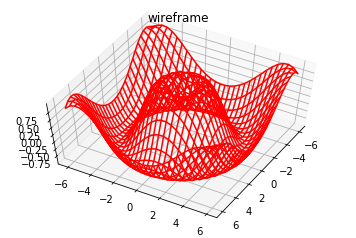
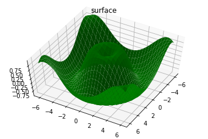
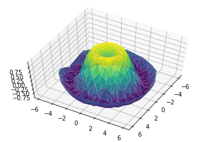

# 三维图

借助于matplotlib自带的mplot3d包，我们可以实现三维图的绘制。 

我们默认使用魔法函数`matplotlib inline`来进行绘制，但是，如果使用魔法函数`%matplotlib notebook`绘制，画出的图是交互式的，我们可以通过拖动图形来让图形转动。

## 简单三维坐标的绘制

通过导入mplot3d包，在`plt.axes`中使用projection参数，我们可以采用默认方式绘制一个三维的坐标系。


```python
%matplotlib inline

import numpy as np
import matplotlib.pyplot as plt

from mpl_toolkits import mplot3d

fig = plt.figure()
ax = plt.axes(projection='3d')


```


## 三维数据的点和线

三维数据主要研究的是`z=f(x,y)`, 如果绘制三维图形，需要有x，y，z，求三个数据然后在相应的点上画点或者连线。

使用的画点或者连线的函数常用的是`ax.plot3d`和`ax.scatter3D`。

为了呈现更好的三维效果，默认散点图会自动改变透明度。


```python
# 画一个螺旋三维线
%matplotlib inline
ax = plt.axes(projection='3d')

#数据准备
z = np.linspace(0,15, 1000)
x = np.sin(z)
y = np.cos(z)

#三维线
ax.plot3D(x, y, z, 'red')

#三维点
zdata = 15 * np.random.random(100)
xdata = np.sin(zdata) + 0.1 * np.random.randn(100)
ydata = np.cos(zdata) + 0.1 * np.random.randn(100)

ax.scatter3D(xdata, ydata, zdata, c=zdata, cmap='Greens')
```


    <mpl_toolkits.mplot3d.art3d.Path3DCollection at 0x7f5014234748>


## 三维等高线

三维图默认的观察视角可能不是最后的，我们可以时候用`ax.view_init`来改变观察视角，两个参数：
- 俯仰角度，即x-y平面的旋转角度
- 方位角度，即沿着z轴顺时针转动角度


```python
def f(x, y):
    return np.sin(np.sqrt(x**2 + y**2))

x = np.linspace(-6, 6, 30)
y = np.linspace(-6, 6, 30)

X, Y = np.meshgrid(x, y)
Z = f(X,Y)

fig = plt.figure()
ax = plt.axes(projection='3d')
ax.contour3D(X, Y, Z, 50)

ax.set_xlabel("X-Axis")
ax.set_ylabel("Y-Axis")
ax.set_zlabel("Z-Axis")

```


    Text(0.5,0,'Z-Axis')


```python
# 上图调整旋转角度为（60， 30）
ax.view_init(60, 30)
fig
```


## 线框图和曲面图

线框图是由网格做成的可视化三维图。线框图显示的是由线条组成的轮廓，相对来讲，曲面图是有多边形构成的多边形，可以更好的显示图形表面的结构。

如果选择合适的坐标系，利用合适的数据区间，可以产生类似切片的可视化效果。


```python
fig = plt.figure()
ax = plt.axes(projection='3d')
#线框图
ax.plot_wireframe(X, Y, Z, color='red')
ax.set_title('wireframe')
ax.view_init(60, 30)
```





```python
fig = plt.figure()
ax = plt.axes(projection='3d')
#线框图
ax.plot_surface(X, Y, Z, color='green')
ax.set_title('surface')
ax.view_init(60, 30)
```





```python
r = np.linspace(0, 6, 30)
theta = np.linspace(-0.9*np.pi, 0.8*np.pi, 40)

r, theta = np.meshgrid(r, theta)

X = r * np.sin(theta)
Y = r * np.cos(theta)
Z = f(X, Y)

ax = plt.axes(projection='3d')
ax.plot_surface(X, Y, Z, cmap='viridis')

ax.view_init(60,-40)
```


## 曲面三角剖分

对于一些要求均匀采样的网格数据显得太过严格而不太容易实现的图像，我们可以使用三角剖分(triangulation-based plot)来解决。 


```python
# 随机散点数据组成的图形

theta = 2 * np.pi * np.random.random(1000)
r = 6 * np.random.random(1000)
x = np.ravel(r * np.sin(theta))
y = np.ravel(r * np.cos(theta))
z = f(x, y)

ax = plt.axes(projection='3d')
ax.scatter(x, y, z, c=z, cmap='viridis', linewidth=1)

ax.view_init(60, 30)
```


```python
#随机数据构成三角剖分
ax = plt.axes(projection='3d')
ax.plot_trisurf(x, y, z, cmap='viridis', edgecolor='none')

ax.view_init(60, 30)
```





