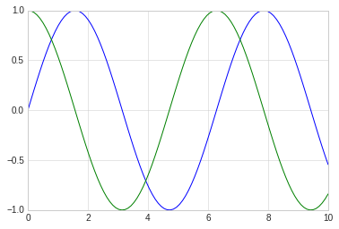
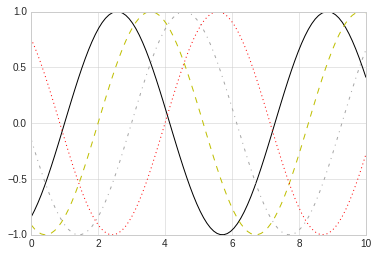
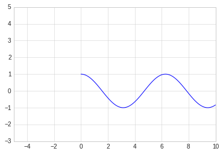
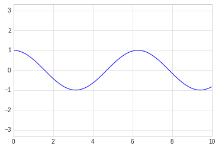
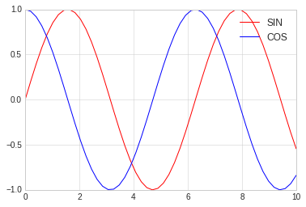
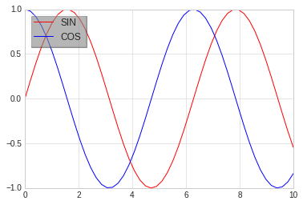
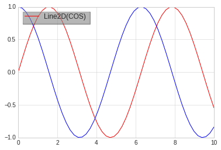

# 图形简单绘制

绘制图形基本函数是plot, 这个函数的工作原理大概是分别取x，y的值，然后取到坐标（x，y）后对不同的连续点进行连线，这样就形成了一条连续的线，如果适当调整各个点直接的跨度，就可以看到一条平滑曲线。 

## 绘制简单图形
需要画如下简单线形图，我们需要创建一个图形fig和一个坐标轴ax。
- fig：figure(plt.Figure)是一个能容纳各种坐标轴，图形，文字和标签的容器。
- ax：axes（plt.Axes）是一个带有刻度和标签的矩形，最终会包含各种可视化元素

在图形绘制中，y=f(x）类函数的显示可以看做是最简单的图形，我们来尝试.


```python
# 绘制 y=f（x）方程的图形

# 图形显示方式
%matplotlib inline
import matplotlib.pyplot as plt
import numpy as np

# 图形显示风格
plt.style.use('seaborn-whitegrid')
 
#创建fig和ax
fig = plt.figure()
ax = plt.axes()


x = np.linspace(0, 10, 100)
# 显示sin函数图形
plt.plot(x, np.sin(x))
#显示cos函数图形
plt.plot(x, np.cos(x))

```


    [<matplotlib.lines.Line2D at 0x7fe669654cc0>]





## 调整图形风格

通过选用相应的参数，可以调整图形绘制线条的特征，比如颜色，风格等。  
图形颜色值可以支持多种定义风格，常见的包括：
- 使用名称： color='red'
- 颜色代码： 采用rgbcmyk格式， color=’g'
- 范围在0-1的灰度值： color=‘0.85’
- 十六进制： RGB模式， clolor=’#FFDD45‘
- RGB元素，范围0-1：color=（0.5， 0.2， 0.9）
- HTML颜色名称：color=’chartreuse‘


```python
# 不同颜色的线条
plt.plot(x, np.sin(x-1), color='black')
plt.plot(x, np.sin(x-2), color='y')
plt.plot(x, np.sin(x-3), color='0.65')
plt.plot(x, np.sin(x-4), color='#FF0000')
plt.plot(x, np.sin(x-5), color=(0.2, 1.0, 1.0))
plt.plot(x, np.sin(x-6), color='chartreuse')

```


    [<matplotlib.lines.Line2D at 0x7fe66949ff28>]


同样，使用linestyle参数可以定制图形中线的特征，常用的linestyle值为：
- solic： 实现，会用 `-`做简写
- dashed：虚线，用`--`做简写
- dashdot：点划线， 用`-.`简写
- dotted：实心点线， 用`：`简写

这几个是比较常用的，所有类型可以通过内置文档进行查看。


```python
# 不同颜色的线条
plt.plot(x, np.sin(x-1), linestyle='solid', color='black')
plt.plot(x, np.sin(x-2),linestyle='--', color='y')
plt.plot(x, np.sin(x-3), linestyle='dashdot',color='0.65')
plt.plot(x, np.sin(x-4), linestyle=':',color='#FF0000')
 
```


    [<matplotlib.lines.Line2D at 0x7fe669478748>]





linestyle和color可以组合在一起使用更简洁的表示形式，plot函数提供了一个非关键字参数可以让我们使用组合简写：


```python
# 使用组合简写

plt.plot(x, x+0, '-r')
plt.plot(x, x+1, '--g')
plt.plot(x, x+2, '-.b')
plt.plot(x, x+3, ':c')
 
```


    [<matplotlib.lines.Line2D at 0x7fe6693a7550>]


## 调整坐标轴

### xlim和ylim
Matplotlib会自动为图形调整坐标轴上下限，但有时候也需要自定义调整，常用的调整方法是：
- plt.xlim： x轴
- plt.ylim: y轴

通过xlim和ylim可以调整x轴y轴的上下限，需要说明的是，这两个函数只是简单的把坐标轴数据改成两个参数之间的值就可以，它并不关心真正设置的值，比如可以设置逆序。


```python
# 手动设置坐标轴
# 考虑到x的取值，我们得到了一个很丑很不协调的sin
plt.plot(x, np.sin(x))

plt.xlim(-5,10)
plt.ylim(-3,5)
```


    (-3, 5)


### axis函数

axis函数可以更灵活更强大的设置坐标轴信息， 可以传入`[xmin, xmax, ymin, ymax]`来设置x，y轴的四个值，也还可以设置坐标轴的风格，比如：

- tight：把图形设置成紧凑模式，即坐标按照图形内容自动收紧坐标轴，不留下空白区域。
- equal：图形显示分辨率为1:1    


```python
# 手动设置坐标轴

plt.plot(x, np.cos(x))
plt.axis([-5,10,-3,5])
```


    [-5, 10, -3, 5]





```python
# 让图形自动紧凑
# 图形空白自动去掉
plt.plot(x, np.cos(x))
plt.axis('tight')
```


    (0.0, 10.0, -0.9999471661761239, 1.0)


```python
# 让图形自动紧凑
# 显示分辨率1:1
plt.plot(x, np.cos(x))
plt.axis('equal')
```


    (0.0, 10.0, -1.0, 1.0)





## 设置图形标签

在对图形进行设置的时候，可能需要一些文字性信息，此类信息主要包含：
- 图形标题：plt.title
- 坐标轴标题: plt.xlabel, plt.ylabel
- 简易图例: plt.legend

对此类信息的设置，中文可能会出现乱码，需要对jupyter Notebook进行单独设置。

### 简单标签和title设置


```python
# 设置sin图形标签

plt.plot(x, np.sin(x ))
plt.title("sin Function")
plt.xlabel("X-Value")
plt.ylabel("Y-Value")
```


    Text(0,0.5,'Y-Value')


### 简单图例设置

通过legend可以设置图例，同时通过参数的调整可以细腻的设置图例的位置，形式等。

常见的参数为：
- loc: 图例位置
- frameon:是否带边框
- framealpha: 颜色透明
- shadow: 阴影


```python
#使用面向对象的方法画图

x = np.linspace(0, 10, 50)

fig, ax = plt.subplots()

ax.plot(x, np.sin(x ), color='red', label="SIN")
ax.plot(x, np.cos(x ), color='blue', label="COS")

#全部使用默认
ax.legend()
```


    <matplotlib.legend.Legend at 0x7fe65abe54e0>





```python
#使用面向对象的方法画图

x = np.linspace(0, 10, 50)

fig, ax = plt.subplots()

ax.plot(x, np.sin(x ), color='red', label="SIN")
ax.plot(x, np.cos(x ), color='blue', label="COS")

#更改位置，添加边框
ax.legend(loc='upper left', frameon=True)
```


    <matplotlib.legend.Legend at 0x7fe65ab9ca58>


```python
#使用面向对象的方法画图

x = np.linspace(0, 10, 50)

fig, ax = plt.subplots()

ax.plot(x, np.sin(x ), color='red', label="SIN")
ax.plot(x, np.cos(x ), color='blue', label="COS")

#更改位置，添加边框
ax.legend(loc='upper left', frameon=True, shadow=True, framealpha=0.2)
```


    <matplotlib.legend.Legend at 0x7fe65a834da0>





### 选择图例显示的元素

选择图例显示元素一般有两种方法：
- 通过设置图形的label属性，不设置的不显示
- 通过给legend传递需要显示的图形，不传递的不显示


```python
# 有时候可能我们并不想把所有线条的图例都显示出来，此时可以选择图例显示的元素

x = np.linspace(0, 10, 50)

fig, ax = plt.subplots()

sin_line  = ax.plot(x, np.sin(x ), color='red', label="SIN")
cos_line = ax.plot(x, np.cos(x ), color='blue', label="COS")

#明确把需要添加图例的线条放入legend作为参数
#没有添加的不显示
ax.legend(cos_line, loc='upper left', frameon=True, shadow=True, framealpha=0.2)
```


    <matplotlib.legend.Legend at 0x7fe65a6f97f0>





```python
# 有时候可能我们并不想把所有线条的图例都显示出来，此时可以选择图例显示的元素

x = np.linspace(0, 10, 50)

fig, ax = plt.subplots()

#默认legend只显示有label的线条，没有的不显示
sin_line  = ax.plot(x, np.sin(x ), color='red', label="SIN")
cos_line = ax.plot(x, np.cos(x ), color='blue')

#只有一个具有label参数，没有的就不显示
ax.legend(loc='upper left', frameon=True, shadow=True, framealpha=0.2)
```


    <matplotlib.legend.Legend at 0x7fe65a64df98>


### 图例中显示不同尺寸


```python
# scatter用来画散点图
# 我们将在后面章节中讲述

rng = np.random.RandomState(0)
x = rng.randn(100)
y = rng.randn(100)

colors = rng.rand(100)
sizes = 1000 * rng.rand(100)

# 设定横轴坐标的范围
plt.xlim(-3, 6)
#画散点图
plt.scatter(x, y, c=colors, s=sizes, alpha=0.4, cmap='viridis')

#显示颜色条
plt.colorbar()

#画图例散点图
for a in [0.1, 0.3, 0.5, 0.7, 0.9]:
    plt.scatter([], [], c='red', alpha=0.5, s=a*300, label="{} Label".format(a))

#画图例文字  
plt.legend(scatterpoints=1, frameon=False, labelspacing=1, title='Random Value')

```


    <matplotlib.legend.Legend at 0x7fe659c3dba8>


## 配置颜色条

使用颜色条来配置图例是一种常规操作， 本章讲述颜色条的配置。


```python
# 准备数据
import matplotlib.pyplot as plt
import numpy as np

plt.style.use('classic')
%matplotlib inline
```

### 简单颜色条配置


```python
x = np.linspace(0,10, 1000)
I = np.sin(x) * np.cos(x[:, np.newaxis])


plt.imshow(I)
plt.colorbar()
```


    <matplotlib.colorbar.Colorbar at 0x7f387a03ca58>


### 配置颜色条

可以通过cmap参数为图形设置颜色条的配置方案, 所有配色方案都在
plt.cm命名空间里，可以直接通过 `plt.cm.<TAB>`查看。


选择合理的配色方案能让实行示例清晰明了，常见的配色方案有：
- 顺序配色方案： 由一组连续的颜色构成的方案，例如binary或者viridis
- 互逆配色方案： 由两种互补的颜色构成，表示正反两种含义，例如RdBu或者PuOr
- 定性配色方案：随机顺序的一组颜色，例如rainbow或者jet


```python
#使用灰色颜色条
x = np.linspace(0,10, 1000)
I = np.sin(x) * np.cos(x[:, np.newaxis])

plt.imshow(I, cmap='RdBu')
plt.colorbar()
```


    <matplotlib.colorbar.Colorbar at 0x7fe659eca5c0>


### 离散型颜色条

颜色条默认是连续的，可以通过设置配色方案和颜色的区间量来显示离散型颜色条。


```python
#使用灰色颜色条
x = np.linspace(0,10, 1000)
I = np.sin(x) * np.cos(x[:, np.newaxis])

#get_cmap两个参数
# 1. 配色方案
# 2. 颜色多少等分
c = plt.cm.get_cmap("PuOr", 10)
plt.imshow(I, cmap=c)
plt.colorbar()
```


    <matplotlib.colorbar.Colorbar at 0x7fe6595ac5c0>


