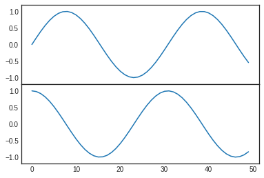
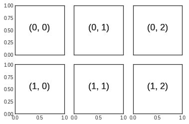
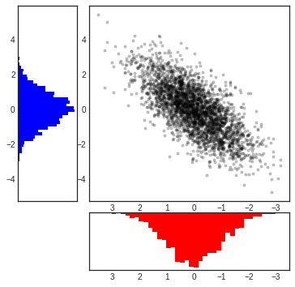

# 多子图

一个界面上有时候需要出现多张图形，这就是多子图。

Matplotlib提供了subplot的概念，用来在较大的图形中同时放置较小的一组坐标轴，这些子图可能是画中画，网格图，或者更复杂的布局形式。 


```python
# 准备数据
%matplotlib inline
import matplotlib.pyplot as plt
import numpy as np

plt.style.use("seaborn-white")
```

## 手动创建多子图

创建坐标轴最基本的方法是用plt.axes函数， 通过设置不同的坐标参数，可以用来手工创建多子图。

多子图坐标系统可以使用四个元素列表，[left, button, width, height],分别是：
- bottom： 底部坐标
- left：左侧坐标
- width： 宽度
- height： 高度

其中数值的取值范围是0-1， 左下角为0.

[0.5, 0.2, 0.3, 0.4]代表从下面开始50%，从左开始20%的地方是图形的左下角，图形宽高占用30%和40%。


```python
#Matlab风格
ax1 = plt.axes()
ax2 = plt.axes([0.4, 0.2, 0.3, 0.6])

```


```python
#面向对象格式
fig = plt.figure()

ax1 = fig.add_axes([0.1, 0.5, 0.8, 0.4], xticklabels=[], ylim=(-1.2, 1.2))
ax2 = fig.add_axes([0.1, 0.1, 0.8, 0.4], ylim=(-1.2, 1.2))

x = np.linspace(0, 10)
ax1.plot(np.sin(x))
ax2.plot(np.cos(x))


```


    [<matplotlib.lines.Line2D at 0x7fc8b5147748>]





##  plt.subplot 建议网格子图

plt.subplot可以创建整齐排列的子图，这个函数有三个整形参数：
- 子图行数
- 子图列数
- 索引值： 索引值从1开始，左上角到右下角逐渐增大


```python
# matlab风格
for i in range(1,7):
    plt.subplot(2,3,i)
    plt.text(0.5, 0.5, str((2,3,i)), fontsize=18, ha='center')
```


```python
#面向对象风格
# plt.subplots_adjust调整子图间隔
# plt.add_subplot

fig = plt.figure()
fig.subplots_adjust(hspace=0.4, wspace=0.4)

for i in range(1,7):
    ax = fig.add_subplot(2,3,i)
    ax.text(0.5, 0.5, str((2,3,i)), fontsize=18, ha='center')
   
```


## 7.3 plt.subplots

一次性创建多个子图，主要四个参数：
- 行数
- 列数
- sharex：是否共享x轴
- sharey：是否共享y轴

下图使用subplots创建2x3个子图，每一行共享y轴，每一列共享x轴。

函数返回值是一个NumPy数组，可以通过下表访问返回的每一个子图。


```python
fig, ax = plt.subplots(2, 3, sharex='col', sharey='row')
```


```python
for i in range(2):
    for j in range(3):
        ax[i,j].text(0.5, 0.5, str((i,j)), fontsize=18, ha='center')

fig
```





##  plt.GridSpec 

利用plt.GridSpec可以用来实现更复杂的多行多列子图网格。这种画图方式跟前端网页技术的网格思想类似，需先用
plt.GridSpec指出需要总共划分的行和列，然后在具体的画相应子图的时候指出一个子图需要占用的网格。


```python
# 画图方式
# 界面总共分成了2行3列
grid = plt.GridSpec(2, 3, wspace=0.4, hspace=0.3)

# 第一个子图占用了第一个方格
plt.subplot(grid[0,0])
# 第二个子图占用了第一行从第二个后面所有的方格
plt.subplot(grid[0,1:])
# 第三个子图占用了第二行到下标2前的方格
plt.subplot(grid[1,:2])
# 第四个子图占用了第二行第三个方格
plt.subplot(grid[1,2])
```


    <matplotlib.axes._subplots.AxesSubplot at 0x7fc8b4d7db00>


```python
# 正态分布数据的多子图显示

mean = [0,0]
cov = [[1,1], [1,2]]
x, y = np.random.multivariate_normal(mean, cov, 3000).T

#设置坐标轴和网格配置
fig = plt.figure(figsize=(6,6))
grid = plt.GridSpec(4,4, hspace=0.2, wspace=0.2)

main_ax = fig.add_subplot(grid[:-1, 1:])
y_hist = fig.add_subplot(grid[:-1, 0], xticklabels=[], sharey=main_ax)
x_hist = fig.add_subplot(grid[-1, 1:], yticklabels=[], sharex=main_ax)

# 主轴坐标画散点图
main_ax.plot(x, y, 'ok', markersize=3, alpha=0.2)

# 次轴坐标画直方图
x_hist.hist(x, 40, histtype='stepfilled', orientation='vertical', color='red')
x_hist.invert_yaxis()


y_hist.hist(x, 40, histtype='stepfilled', orientation='horizontal', color='blue')
x_hist.invert_xaxis()

```




