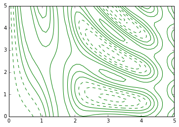
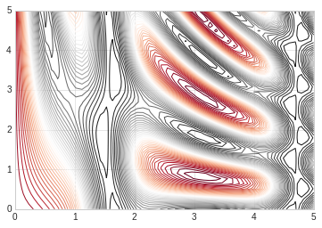
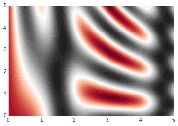
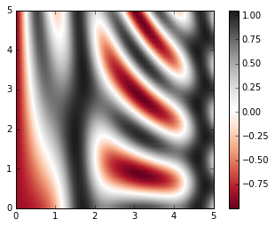

# 密度图和等高线

等高线或者密度图使我们常用图形， Matplotlib提供三个函数来供我们使用：
- plt.contour: 等高线
- plt.contourf: 自带填充色
- plt.imshow： 显示图形

具体使用请参照下面例子：


```python
#准备环境
%matplotlib inline
import matplotlib.pyplot as plt
import numpy as np

# 设置风格
plt.style.use('seaborn-whitegrid')
```

## contour

我们需要一个三维函数，z=f(x,y)来演示等高线图，按照下面函数来进行生成.

contour创建需要至少三个参数，x，y和z，其中x，y我们可以用横轴纵轴表示，z用等高线来表示就可以。当只有一个颜色的图形是，虚线表示负值，实现部分表示正值。

我们使用meshgrid来从一维数据构成二维网格数据。


```python
#函数
def f(x, y):
    return np.sin(x) ** 10 + np.cos(10 + y*x) * np.cos(x)

x = np.linspace(0, 5, 50)
y = np.linspace(0, 5, 40)

#得到网格点矩阵
x, y = np.meshgrid(x, y)

# 计算z轴的值
z = f(x,y)

#绘制图形
plt.contour(x, y, z, colors='green')

```


    <matplotlib.contour.QuadContourSet at 0x7f3879e8cdd8>





```python
#绘制图形
#使用红灰色配色方案
#把值范围50等分
plt.contour(x, y, z, 50, cmap='RdGy')
```


    <matplotlib.contour.QuadContourSet at 0x7fe65b190550>





## plt.contourf

以上绘图还是存在比如间隙过大的问题，我们可以用连续的颜色来填充图形，让它变的平滑起来。

plt.contourf可以满足我们的需求，其余填充参数基本同plt.contour一致。


```python
#绘制图形
#平滑过度色彩
plt.contourf(x, y, z, 50, cmap='RdGy')
```


    <matplotlib.contour.QuadContourSet at 0x7fe65b017908>





## plt.imshow

上述图形的显示色彩过度还是不够细腻，因为画上面的图的时候使用的是一条一条的线来绘制，虽然可以通过缩小间隙来让图形更加细腻，但是这样会造成计算资源的过度浪费，Matplotlib为我们提供了imshow来完成渐变图的渲染。


- plt.imshow函数不支持x，y轴的设置，必须通过extent参数来完成设置，extent=[xmin, xmax, ymin, ymax]
- plt.imshow默认以右上角为坐标原点，一般我们使用左下角为坐标原点
- plt.imshow自动调整坐标轴精度来适配数据显示，可以通过plt.axis(aspect='image')来设置x，y的单位


```python
# imshow

plt.imshow(z, extent=[0, 5, 0, 5], origin='lower', cmap='RdGy')

plt.colorbar()
plt.axis(aspect='image')

```


    (0.0, 5.0, 0.0, 5.0)





```python
# 显示等高线的同时通过颜色显示内容

contours = plt.contour(x, y, z, 3, colors="green")
plt.clabel(contours, inline=True, fontsize=8)


plt.imshow(z, extent=[0, 5, 0, 5], origin='lower', cmap='RdGy', alpha=0.2)

plt.colorbar()
plt.axis(aspect='image')

```


    (0.0, 5.0, 0.0, 5.0)


