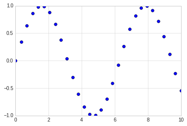
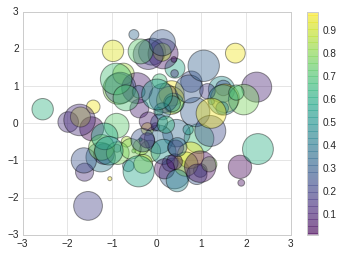

# 散点图

散点图（Scatter Plot）主要是以点为主，数据是不连续的数据，通过设置线的型号为圆点来完成。 
其余的线的形状为：
-    ``'.'``          point marker
-    ``','``          pixel marker
-    ``'o'``          circle marker
-    ``'v'``          triangle_down marker
-    ``'^'``          triangle_up marker
-    ``'<'``          triangle_left marker
-    ``'>'``          triangle_right marker
-    ``'1'``          tri_down marker
-    ``'2'``          tri_up marker
-    ``'3'``          tri_left marker
-    ``'4'``          tri_right marker
-    ``'s'``          square marker
-    ``'p'``          pentagon marker
-    ``'*'``          star marker
-    ``'h'``          hexagon1 marker
-    ``'H'``          hexagon2 marker
-    ``'+'``          plus marker
-    ``'x'``          x marker
-    ``'D'``          diamond marker
-    ``'d'``          thin_diamond marker
-    ``'|'``          vline marker
-    ``'_'``          hline marker

## 简单散点图


```python
#准备环境
%matplotlib inline
import matplotlib.pyplot as plt
import numpy as np

# 设置风格
plt.style.use('seaborn-whitegrid')

```


```python
x = np.linspace(0,10, 30)
y = np.sin(x)

# 通过设置线型为点来完成三点图的显示
plt.plot(x, y, 'o', color='blue')

```


    [<matplotlib.lines.Line2D at 0x7fe668f962b0>]





## 其他散点图形状


```python
# 散点图的形状展示

rng = np.random.RandomState(0)

for marker in ['o', '.', 'x', '+', '^', '<', 's', 'd']:
    plt.plot(rng.rand(5), rng.rand(5), marker, label='marker={}'.format(marker))
    plt.legend(numpoints=1)
    plt.xlim(0, 1.8)
```


## 点线结合的图

在plot的使用中，对线的类型使用直线(-)，圆圈(o)可以画出带有点线结合的图形。


```python
x = np.linspace(0,10, 30)
y = np.sin(x)

# 通过设置线型为点来完成三点图的显示
plt.plot(x, y, '-o', color='blue')
```


    [<matplotlib.lines.Line2D at 0x7fe6692aa748>]


## 使用plt.scatter画散点图

另一个画散点图的函数是scatter，用法和plot函数类似。

但scatter更加灵活，甚至可以单独控制每个散点不同的属性，例如大小，颜色，边控等。 

相对来讲，对于大量数据的渲染，plot效率要高于scatter。


```python
# scatter案例

rng = np.random.RandomState(0)
x = rng.randn(100)
y = rng.randn(100)

colors = rng.rand(100)
sizes = 1000 * rng.rand(100)
plt.scatter(x, y, c=colors, s=sizes, alpha=0.4, cmap='viridis')

#显示颜色条
plt.colorbar()
```


    <matplotlib.colorbar.Colorbar at 0x7fe668405438>




