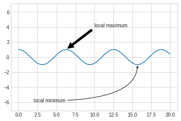
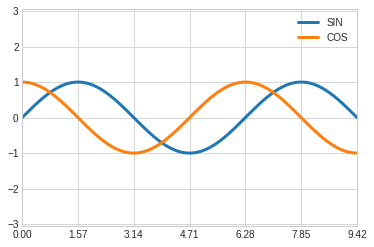

# 文字与注释

## 坐标变换和文字位置

通过不同的坐标变换，可以把文字放在不同的位置，文字的坐标变换方法有：
- ax.transData：以数据为基准的坐标变换，直接用数字把坐标表示出来，绝对数据
- ax.transAxes： 以轴为基准，坐标数据表示轴中的相对位置


```python
#环境准备

%matplotlib inline
import matplotlib.pyplot as plt
import numpy as np

plt.style.use("seaborn-whitegrid")
```


```python
fig, ax = plt.subplots(facecolor='lightgray')
ax.axis([0, 10, 0, 10])

ax.text(1, 5, "Data:(1,5)", transform=ax.transData)
ax.text(0.5, 0.1, "Axes:(0.5, 0.1)", transform=ax.transAxes)

```


    Text(0.5,0.1,'Axes:(0.5, 0.1)')


## 箭头和注释

带箭头的注释一般可以使用两个函数实现：
- plt.arrow: 产生SVG向量图形式的箭头，会随着分辨率改变而变换，不推荐
- plt.annotate: 可以创建文字和箭头

在annotate中，箭头的风格通过arrowprops参数控制，具体参数含义使用的时候可以参考官方文档。


```python
fig, ax = plt.subplots()

x = np.linspace(0, 20, 1000)
ax.plot(x, np.cos(x))
ax.axis('equal')

ax.annotate("local maximum", xy=(6.28, 1), xytext=(10, 4), \
            arrowprops=dict(facecolor='black',shrink=0.05 ))

ax.annotate('local minimum', xy=(5 * np.pi, -1), xytext=(2, -6),\
           arrowprops=dict(arrowstyle="->", connectionstyle='angle3, angleA=0, angleB=-90'))


```


    Text(2,-6,'local minimum')





## 自定义坐标轴刻度

Matplotlib有默认的坐标轴定位器(locator)和格式生成器(formatter)，基本需求可以满足自定义坐标轴的需求，但是如果需要定制更细腻的表现，需要用到其他的东西。

Matplotlib画图的基本原理是：
- figure对象可以看做是一个图形的总的容器，里面可以包含几个子图
- axes：每个figure包含一个或者多个axes，每个axes有包含其他表示图形内容的对象
- 每个axes有xaxis和yaxis属性，每个属性包含坐标轴的线条，刻度，标签等属性

### 主要刻度和次要刻度


通过一下案例，我们发现主要和次要刻度标签都是通过LogLocater对象设置的， 同样格式生成器都是LogFormatterSciNotaion对象。


```python
ax = plt.axes(xscale='log', yscale='log')

print(ax.xaxis.get_major_locator())
print(ax.xaxis.get_minor_locator())

print(ax.xaxis.get_major_formatter())
print(ax.xaxis.get_minor_formatter())
```

    <matplotlib.ticker.LogLocator object at 0x7fd697b69c50>
    <matplotlib.ticker.LogLocator object at 0x7fd697b69a58>
    <matplotlib.ticker.LogFormatterSciNotation object at 0x7fd697b69a90>
    <matplotlib.ticker.LogFormatterSciNotation object at 0x7fd697be4a58>


### 隐藏刻度和标签

有时候我们不需要总显示刻度和标签，可以通过设置空的刻度标签和格式化生成器完成。


```python
# 删除locator和formmater
ax = plt.axes()

ax.plot(np.random.rand(50))

ax.yaxis.set_major_locator(plt.NullLocator())
ax.xaxis.set_major_formatter(plt.NullFormatter())
```


### 增减刻度数量


```python
# 一下图例使用默认刻度，但显得过于拥挤
fig, ax = plt.subplots(4, 4, sharex=True, sharey=True)
```


使用plt.MaxNLocator可以设置最多需要显示多少刻度，根据设置的刻度数量，Matplotlib会自动为刻度安排恰当的位置。


```python
for axi in ax.flat:
    axi.xaxis.set_major_locator(plt.MaxNLocator(3))
    axi.yaxis.set_major_locator(plt.MaxNLocator(3))
    
fig

```


### 花哨的刻度格式

使用MultipleLocator可以实现把刻度放在你提供的数值的倍数上。


```python
fig, ax = plt.subplots()

x = np.linspace(0, 3*np.pi, 100)

ax.plot(x, np.sin(x), lw=3, label='SIN')
ax.plot(x, np.cos(x), lw=3, label='COS')

#设置网格，图例和坐标轴上下限
ax.grid(True)
ax.legend(frameon=False)
ax.axis('equal')
ax.set_xlim(0, 3*np.pi)
```


    (0, 9.42477796076938)


```python
ax.xaxis.set_major_locator(plt.MultipleLocator(np.pi/2))
ax.xaxis.set_minor_locator(plt.MultipleLocator(np.pi/4))
fig
```





### 定位器和格式生成器常用值

定位器和格式生成器常用的取值在plt命名空间内可以找到，下面列出来：

- NullLocator: 无刻度
- FixedLocator：刻度位置固定
- IndexLocator：用索引做定位器，例如x=range(10)
- LinearLocator: 从min到max均匀分布
- LogLocator: 从min到max对数分布
- MultipleLocator： 刻度和范围是基数的倍数
- MaxNLocator： 为最大刻度找到最优位置
- AutoLocator： 以MaxNlocator进行简单配置
- AutoMinorLocator：次要刻度的定位器


格式生成器的取值：
- NullFormatter： 刻度上无标签
- IndexFormatter： 将一组标签设置为字符串
- FixedFormatter： 手动设置标签
- FuncFormatter：自定义函数设置标签
- FormatStrFormatter：为每个刻度设置字符串格式
- ScalarFormatter： 为标量值设置标签
- LogFormatter： 对数坐标轴的默认格式生成器

