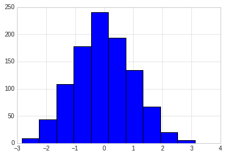
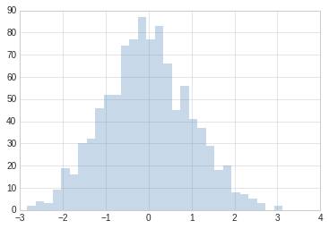
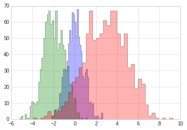
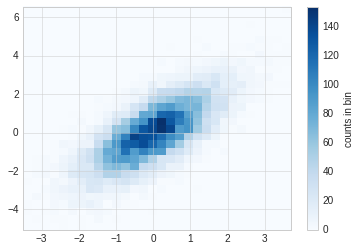
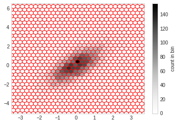
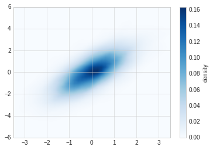

# 频次直方图，数据区间划分和分布密度


```python
#准备环境
%matplotlib inline
import matplotlib.pyplot as plt
import numpy as np

# 设置风格
plt.style.use('seaborn-whitegrid')
```

## 频次直方图

使用plt.hist可以画直方图，重要的参数有：
- bins: 画几条方图
- color: 颜色
- alpha: 透明度
- histtype: 图类型


```python
data = np.random.randn(1000)
plt.hist(data)
```


    (array([  9.,  44., 108., 178., 241., 194., 134.,  67.,  20.,   5.]),
     array([-2.83511303, -2.23919796, -1.64328288, -1.04736781, -0.45145274,
             0.14446234,  0.74037741,  1.33629248,  1.93220755,  2.52812263,
             3.1240377 ]),
     <a list of 10 Patch objects>)





```python
plt.hist(data, bins=30, alpha=0.3, histtype='stepfilled', color='steelblue', edgecolor='none')
```


    (array([ 2.,  4.,  3.,  9., 19., 16., 30., 32., 46., 52., 52., 74., 77.,
            87., 77., 83., 66., 45., 56., 41., 37., 29., 18., 20.,  8.,  7.,
             5.,  3.,  0.,  2.]),
     array([-2.83511303, -2.63647467, -2.43783631, -2.23919796, -2.0405596 ,
            -1.84192124, -1.64328288, -1.44464453, -1.24600617, -1.04736781,
            -0.84872945, -0.6500911 , -0.45145274, -0.25281438, -0.05417602,
             0.14446234,  0.34310069,  0.54173905,  0.74037741,  0.93901577,
             1.13765412,  1.33629248,  1.53493084,  1.7335692 ,  1.93220755,
             2.13084591,  2.32948427,  2.52812263,  2.72676099,  2.92539934,
             3.1240377 ]),
     <a list of 1 Patch objects>)





```python
#更复杂的案例

x1 = np.random.normal(0, 0.8, 1000)
x2 = np.random.normal(-2, 1, 1000)
x3 = np.random.normal(3,2, 1000)

kwargs = dict(histtype='stepfilled', alpha=0.3, bins=40)

plt.hist(x1, **kwargs)
plt.hist(x2, **kwargs)
plt.hist(x3, **kwargs)

```


    (array([ 1.,  0.,  1.,  2.,  5.,  2.,  6.,  5.,  8., 11., 17., 23., 26.,
            32., 35., 53., 67., 49., 50., 53., 61., 58., 67., 67., 53., 45.,
            53., 32., 34., 19., 25., 22.,  9.,  2.,  4.,  1.,  0.,  1.,  0.,
             1.]),
     array([-3.90483644, -3.575889  , -3.24694156, -2.91799412, -2.58904668,
            -2.26009924, -1.9311518 , -1.60220436, -1.27325692, -0.94430948,
            -0.61536204, -0.2864146 ,  0.04253285,  0.37148029,  0.70042773,
             1.02937517,  1.35832261,  1.68727005,  2.01621749,  2.34516493,
             2.67411237,  3.00305981,  3.33200725,  3.66095469,  3.98990213,
             4.31884957,  4.64779701,  4.97674445,  5.30569189,  5.63463934,
             5.96358678,  6.29253422,  6.62148166,  6.9504291 ,  7.27937654,
             7.60832398,  7.93727142,  8.26621886,  8.5951663 ,  8.92411374,
             9.25306118]),
     <a list of 1 Patch objects>)





## 二维频次直方图和数据区间划分


```python
# 准备数据

mean = [0, 0]
cov = [[1,1], [1,2]]

# 多元正太分布随机样本抽取
# mean:多元正态分布的维度
# cov:多元正态分布的协方差矩阵，且协方差矩阵必须是对称矩阵和半正定矩阵(形状为(N,N)的二维数组)。
# size: 数组的形状（整数或者由整数构成的元组）。如果该值未给定，则返回单个N维的样本（N恰恰是上面mean的长度）。
x, y = np.random.multivariate_normal(mean, cov, 10000).T
```

## plt.hist2d 

使用plt.hist2d可以画二维直方图。 


```python
plt.hist2d(x, y, bins=30, cmap='Blues')
cb = plt.colorbar()
cb.set_label("counts in bin")
```





## plt.hexbin

hist2d是用的方块组成的图形，还可以使用六边形进行图形分割，需要使用plt.hexbin来完成，用来将图形化成六角形的蜂窝。


```python
plt.hexbin(x, y, gridsize=30, color='red')
cb = plt.colorbar(label="count in bin")
```





##  核密度估计

核密度估计(KernelDensityEstimation)是一种常用的评估多维度分布密度的方法，本节主要是对画图函数做一个展示，不详细讲述kde算法。 

kde方法通过不同的平滑带宽长度在拟合函数的准确性和平滑性之间做出一种权衡。


```python
from scipy.stats import gaussian_kde

data = np.vstack([x, y])
kde = gaussian_kde(data)

x = np.linspace(-3.5, 3.5, 40)
y = np.linspace(-6, 6, 40)

x, y = np.meshgrid(x, y)

z = kde.evaluate(np.vstack([x.ravel(), y.ravel()]))

plt.imshow(z.reshape(x.shape), origin='lower', aspect='auto', extent=[-3.5, 3.5, -6, 6], cmap='Blues')

cb = plt.colorbar()
cb.set_label("density")
```




