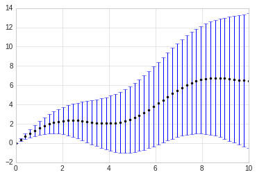
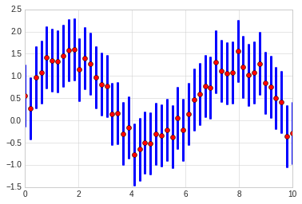
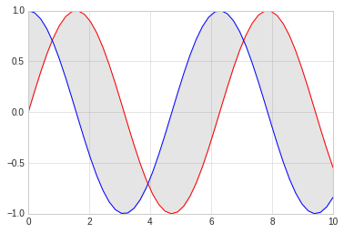

# 误差线

通过对误差线的绘制，可以直观反映出数据的误差大小等。


```python
#准备环境
%matplotlib inline
import matplotlib.pyplot as plt
import numpy as np

# 设置风格
plt.style.use('seaborn-whitegrid')
```

## 基本误差线

误差线使用函数plt.errorbar来创建，可以使用不同的参数进行配置。
- ecolor: 控制误差线颜色
- fmt：线型，代码与plot线型控制参数一致


```python
# 基本误差线
x = np.linspace(0, 10, 50)
dy = x * 0.7

y = np.sin(x) + dy

plt.errorbar(x, y, yerr=dy, fmt='.k', ecolor='blue')

```


    <ErrorbarContainer object of 3 artists>





```python
x = np.linspace(0, 10, 50)
dy =  0.7

y = np.sin(x) + dy * np.random.rand(50)

plt.errorbar(x, y, yerr=dy, fmt='o', ecolor='blue', color='red', elinewidth=3, capsize=1)
```


    <ErrorbarContainer object of 3 artists>





## 连续误差

连续误差表示的是连续量，没有比较合适的简单方法来绘制此类型图形，我们可以使用plt.plot和plt.fill_between来解决，即画出两条区间线表示上下限，然后填充中间区域即可。

下面我们对sin和cos进行简单绘制，绘制后填充两个的中间差值。


```python
 

x = np.linspace(0,10, 50)
ysin = np.sin(x)
ycos = np.cos(x)

plt.plot(x, ysin, color='red')
plt.plot(x, ycos, color='blue')

plt.fill_between(x, ysin, ycos, color='gray', alpha=0.2)
```


    <matplotlib.collections.PolyCollection at 0x7fe65b2eb860>



