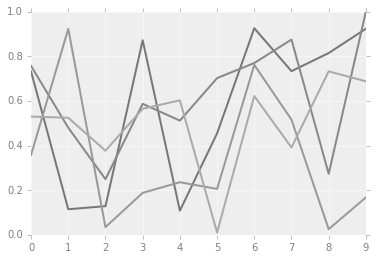
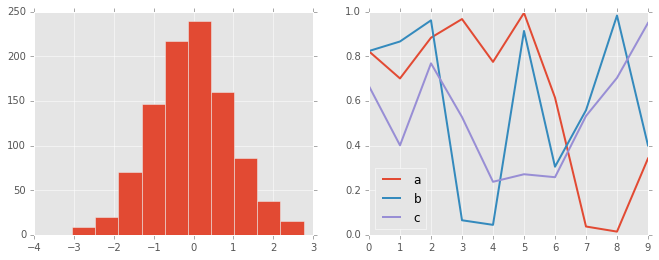
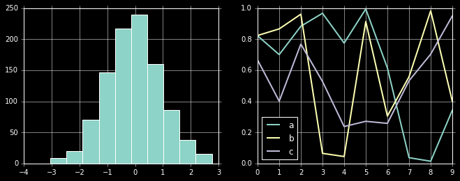
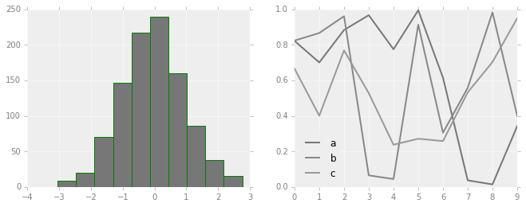

# 配置文件和样式表

Matplotlib允许手动调整默认样式，如果默认拍照不能满足的情况下，可以手动调整样式。

而对于样式表，每个程序都有一套完整的配色方案，我们可以对起进行修改或者替换，系统给我们提供了很多固定风格的
搭配，如果需要，不建议过多修改配置内容，必要的时候直接替换样式表就好，必要的时候做一些微小改动即可满足需求。

## 手动配置图形

通过手动配置图形，可以改变图形的刻度，背景等内容，下面例子是对图形配置的一个简单示例。


```python
#设置环境
import matplotlib.pyplot as plt
import numpy as np

plt.style.use('classic')

%matplotlib inline
```


```python
#使用默认配置显示图形
x = np.random.randn(1000)
plt.hist(x)
```


    (array([  1.,   3.,  43., 119., 237., 285., 195.,  92.,  22.,   3.]),
     array([-3.90095153, -3.1706347 , -2.44031787, -1.71000103, -0.9796842 ,
            -0.24936737,  0.48094946,  1.2112663 ,  1.94158313,  2.67189996,
             3.40221679]),
     <a list of 10 Patch objects>)


```python
# 对图形进行各种配置

ax = plt.axes()
ax.set_axisbelow(True)

#被色网格线
plt.grid(color='g', linestyle='solid')

#隐藏坐标的线条
for spine in ax.spines.values():
    spine.set_visible(False)

#隐藏上边和右边的刻度
ax.xaxis.tick_bottom()
ax.yaxis.tick_left()

#弱化刻度和标签
ax.tick_params(colors='green', direction='out')
for tick in ax.get_xticklabels():
    tick.set_color('orange')

for tick in ax.get_yticklabels():
    tick.set_color('orange')

#设置频次直方图轮廓色和填充色
ax.hist(x, edgecolor="#1122FF", color='#998877')
```


    (array([  1.,   3.,  43., 119., 237., 285., 195.,  92.,  22.,   3.]),
     array([-3.90095153, -3.1706347 , -2.44031787, -1.71000103, -0.9796842 ,
            -0.24936737,  0.48094946,  1.2112663 ,  1.94158313,  2.67189996,
             3.40221679]),
     <a list of 10 Patch objects>)


## 修改默认配置

默认配置在修改的时候需要先把系统默认配置保存，使用完毕后需要还原配置。


```python
#保存默认的配置，修改后需要还原
rc_default = plt.rcParams.copy()

from matplotlib import cycler
colors = cycler('color', ['#777777', '#888888', '#999999', '#AAAAAA', '#BBBBBB', '#CCCCCC'])

plt.rc('axes', facecolor='#EEEEEE', edgecolor='none', \
       axisbelow=True, grid=True, prop_cycle=colors)

plt.rc('grid', color='w', linestyle='solid')
plt.rc('xtick', direction='out', color='gray')
plt.rc('ytick', direction='out', color='gray')
plt.rc('patch', edgecolor='green')
plt.rc('lines', linewidth=2)

plt.hist(x)

```


    (array([  1.,   3.,  43., 119., 237., 285., 195.,  92.,  22.,   3.]),
     array([-3.90095153, -3.1706347 , -2.44031787, -1.71000103, -0.9796842 ,
            -0.24936737,  0.48094946,  1.2112663 ,  1.94158313,  2.67189996,
             3.40221679]),
     <a list of 10 Patch objects>)


```python
for i in range(4):
    plt.plot(np.random.rand(10))
    
plt.rcParams.update(rc_default)
```





## 样式表

样式表就是系统给提供的完整配置方案。

在style模块里，包含大量样式表可以使用。

使用`plt.style.available`可以得到所有可用的样式：


```
['seaborn-dark', 'tableau-colorblind10', 'fivethirtyeight', 'seaborn-white', 'seaborn-bright', 'seaborn-deep', 'ggplot', 'Solarize_Light2', 'seaborn-colorblind', 'seaborn-darkgrid', 'seaborn-pastel', 'seaborn', 'seaborn-talk', '_classic_test', 'seaborn-notebook', 'dark_background', 'fast', 'seaborn-dark-palette', 'classic', 'grayscale', 'seaborn-poster', 'bmh', 'seaborn-ticks', 'seaborn-whitegrid', 'seaborn-paper', 'seaborn-muted']

```

对样式的使用，可以使用代码`plt.style.use('stylename')`来处理。但这个会改变以后所有的风格，如果需要，建议使用风格上下文管理器来临时更换：

`plt.style.context('stylename')`

通过风格上下文管理器，我们可以临时更换配置方案而不必操心还原等操作，一旦离开上下文管理器的作用范围，则临时上下文管理器就失效。


```python
# 准备数据
def hist_and_lines():
    np.random.seed(0)
    fig, ax = plt.subplots(1,2,figsize=(11,4))
    ax[0].hist(np.random.randn(1000))
    for i in range(3):
        ax[1].plot(np.random.rand(10))
    ax[1].legend(['a', 'b', 'c'], loc='lower left')
```

### 默认风格


```python
#还原默认风格
plt.rcParams.update(rc_default)

hist_and_lines()

```


### FiveThirtyEight风格

这个风格是模仿网站FiveThirtyEight。

`http://fivethirtyeight.com`


```python
with plt.style.context('fivethirtyeight'):
    hist_and_lines()
```


### ggplot风格

ggplot是R语言非常流行的可视化工具，ggplot风格就是模仿ggplot工具包。


```python
with plt.style.context('ggplot'):
    hist_and_lines()
```





### bmh风格


```python
with plt.style.context('bmh'):
    hist_and_lines()
```


### 黑色背景风格


```python
with plt.style.context("dark_background"):
    hist_and_lines()
```





### 灰度风格


```python
with plt.style.context("grayscale"):
    hist_and_lines()
```


### Seaborn风格


```python
# 导入seaborn库的时候自动导入seaborn风格
import seaborn
hist_and_lines()
```




