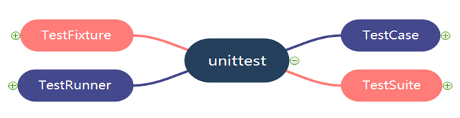
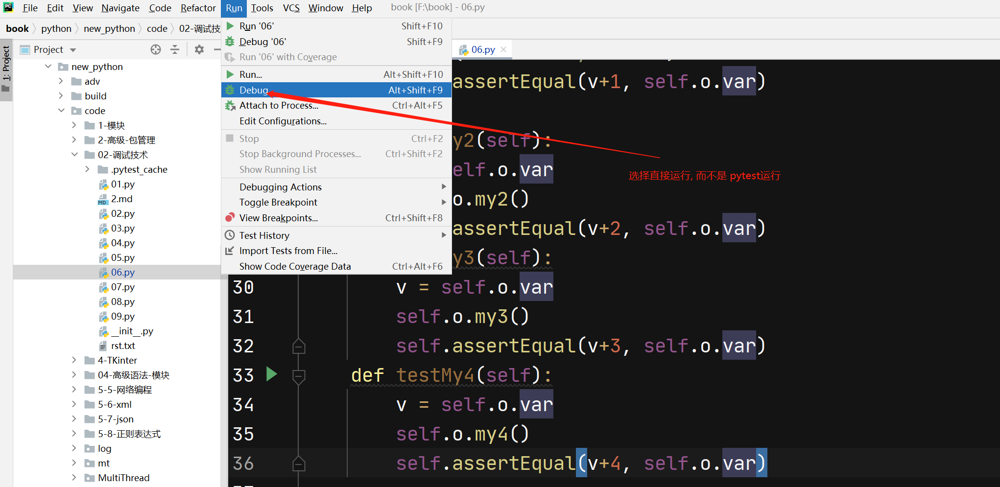

# 单元测试

单元测试负责对最小的软件设计单元（模块）进行验证，它使用软件设计文档中对模块的描述作为指南，对重要的程序分支进行测试以发现模块中的错误。

> 单元测试主要用来自动化完成对单元代码的测试并给出测试报告，属于自动化测试的基础内容。

我们使用的单元测试模块为 `PyUnit`。

推荐文档：
- [官方测试文档集合](https://wiki.python.org/moin/PythonTestingToolsTaxonomy)
- [PyUnit](https://wiki.python.org/moin/PyUnit)

## Python 常见单元测试模块/框架

Python 常见测试框架一如其他方面框架，很多，也有点杂，常见的如下：

- `unittest`: 内置库，模仿 `PyUnit` 写的，简洁易用，缺点是比较繁琐

- `nose`: 测试发现，发现并运行测试

- `pytest`: 笔者目前喜欢用这个，写起来很方便，并且很多知名开源项目在用，推荐

- `tox`: 最大的特色，是自动最测试环境的管理以及使用多个解析器配置进行测试。

        tox的详细文档：http://testrun.org/tox/latest/
     
- `mock`: `unittest.mock` 是用来测试 `python` 的库。在 `python3.3` 版本以后，这个是一个标准库

     `mock` 的精髓在于，你可以使用模拟的对象来替代你的系统的一部分，然后验证后续的执行是否正确。

     mock的详细文档：http://www.voidspace.org.uk/python/mock/       
 
- `Doctest`: `doctest` 模块会搜索那些看起来像交互式会话的 `Python` 代码片段，然后尝试执行并验证结果

    
## 单元测试

`unittest` 是 Python 内置的用于测试代码的模块，无需安装，使用简单方便。



`unittest` 中最核心的部分是：`TestFixture`、`TestCase`、`TestSuite`、`TestRunner`。

`unittest case` 的运行流程：

1. 写好一个完整的 `TestCase`，可以单独运行
2. 如果需要，多个 `TestCase` 由 `TestLoder` 被加载到 `TestSuite` 里面，`TestSuite` 也可以嵌套 `TestSuite`
3. 由 `TextTestRunner` 来执行 `TestSuite`，测试的结果保存在 `TextTestResult` 中
4. `TestFixture` 指的是环境准备和恢复

### 被测代码准备

我们尝试对一些代码进行测试，被测试代码如下：

```python
import time

class BeTested(object):
    def __init__(self):
        self.var = 100
        self.name = "Name_0"

    def my1(self):
        self.var += 1
        return self.var

    def my2(self):
        self.var += 2
        return self.var

    def my3(self):
        self.var += 3
        return self.var

    def my4(self):
        self.var += 4
        return self.var
```

上述代码简单，请自行理解并阅读，我们尝试对代码进行测试。

## `TestCase`

我们对被测代码进行测试，代码如下：

```python
class MyUT(ut.TestCase):
    def setUp(self):
        # global bt
        print("TESTING started............")
        self.o = bt.BeTested()

    def tearDown(self):
        print("TEST IS DONE !!!!!!!!!")

    def testMy1(self):
        v = self.o.var
        self.o.my1()
        print("RUN testMy1.....")
        self.assertEqual(v+1, self.o.var)

    def testMy2(self):
        v = self.o.var
        self.o.my2()
        self.assertEqual(v+2, self.o.var)

    def testMy3(self):
        v = self.o.var
        self.o.my3()
        self.assertEqual(v+3, self.o.var)

    def testMy4(self):
        v = self.o.var
        self.o.my4()
        self.assertEqual(v+4, self.o.var)
```

我们尝试编写测试单元：

- 每个用来测试的类必须是 `TestCase` 子类，参见代码定义。

- 具体的测试案例是以 `test` 开头的函数，属于正常的实例函数，每个函数模拟一种情况进行测试。

- 需要注意函数 `setUp` 和 `tearDown`，在每次运行测试案例（注意是每次），及以 `test` 开头的函数的时候，都要先执行 `setUp` 函数用来构建测试环境。

- 同样每个测试函数执行完毕后需要执行 `tearDown` 清除环境，以免改动环境对下面的测试有影响。

每个以 `test` 开头的函数会被自动执行，当然也可以被手动调用，运行方式如下：

- 如果是单独执行某个测试函数，则可以参考下面代码：

```python
if __name__ == "__main__":
    # 单个使用
    # 需要手动调用setUp
    u = MyUT()
    u.setUp()
    u.testMy1()
    u.tearDown()
```

上面代码表示单独执行测试案例 `testMy1`，执行结果如下：

```
C:\Users\Augs\Anaconda3\python.exe "C:\Program Files\JetBrains\PyCharm Community Edition 2020.2.3\plugins\python-ce\helpers\pydev\pydevd.py" --multiproc --qt-support=auto --client 127.0.0.1 --port 53253 --file F:/book/python/new_python/code/02-调试技术/06.py
pydev debugger: process 13452 is connecting

Connected to pydev debugger (build 202.7660.27)
TESTING started............
RUN testMy1.....
TEST IS DONE !!!!!!!!!

Process finished with exit code 0
```

上面测试没有问题则没有结果，如果测试没有通过则报异常，如果把被测代码修改成：

```python
def testMy1(self):
    v = self.o.var
    self.o.my1()
    print("RUN testMy1.....")
    # 修改代码如下
    # self.assertEqual(v+1, self.o.var)
    self.assertEqual(v, self.o.var)
```

测试不通过，则报异常：

```
c:\Users\Augs\Anaconda3\python.exe "C:\Program Files\JetBrains\PyCharm Community Edition 2020.2.3\plugins\python-ce\helpers\pydev\pydevd.py" --multiproc --qt-support=auto --client 127.0.0.1 --port 53552 --file F:/book/python/new_python/code/02-调试技术/06.py
pydev debugger: process 14012 is connecting

Connected to pydev debugger (build 202.7660.27)
TESTING started............
RUN testMy1.....
python-BaseException
Traceback (most recent call last):
  File "C:\Program Files\JetBrains\PyCharm Community Edition 2020.2.3\plugins\python-ce\helpers\pydev\pydevd.py", line 1448, in _exec
    pydev_imports.execfile(file, globals, locals)  # execute the script
  File "C:\Program Files\JetBrains\PyCharm Community Edition 2020.2.3\plugins\python-ce\helpers\pydev\_pydev_imps\_pydev_execfile.py", line 18, in execfile
    exec(compile(contents+"\n", file, 'exec'), glob, loc)
  File "F:/book/python/new_python/code/02-调试技术/06.py", line 46, in <module>
    u.testMy1()
  File "F:/book/python/new_python/code/02-调试技术/06.py", line 23, in testMy1
    self.assertEqual(v, self.o.var)
  File "C:\Users\Augs\Anaconda3\lib\unittest\case.py", line 829, in assertEqual
    assertion_func(first, second, msg=msg)
  File "C:\Users\Augs\Anaconda3\lib\unittest\case.py", line 822, in _baseAssertEqual
    raise self.failureException(msg)
AssertionError: 100 != 101

Process finished with exit code 1
```

> 注意：
> pycharm 默认不是用 python 运行测试代码，而是 pytest，此时不会执行代码 `if __name__=="__main__":`，所以会默认执行所有测试案例，如果需要执行主程序，则需要用 `python` 方式执行代码，参考下面示例，在弹出对话框中选择：
> 

- 如果想执行完整的测试案例，及所有测试案例，则可以参考下面代码：

```python
if __name__ == "__main__":
    # 完全运行
    u = MyUT()
    ut.main()
```

执行结果会把所有测试案例都跑一遍，结果如下：

```
C:\Users\Augs\Anaconda3\python.exe "C:\Program Files\JetBrains\PyCharm Community Edition 2020.2.3\plugins\python-ce\helpers\pydev\pydevd.py" --multiproc --qt-support=auto --client 127.0.0.1 --port 54202 --file F:/book/python/new_python/code/02-调试技术/06.py
pydev debugger: process 13448 is connecting

Connected to pydev debugger (build 202.7660.27)
TESTING started............
RUN testMy1.....
TEST IS DONE !!!!!!!!!
TESTING started............
TEST IS DONE !!!!!!!!!
TESTING started............
TEST IS DONE !!!!!!!!!
TESTING started............
TEST IS DONE !!!!!!!!!
F...
FAIL: testMy1 (__main__.MyUT)
----------------------------------------------------------------------
Traceback (most recent call last):
  File "F:/book/python/new_python/code/02-调试技术/06.py", line 23, in testMy1
    self.assertEqual(v, self.o.var)
AssertionError: 100 != 101

----------------------------------------------------------------------
Ran 4 tests in 0.002s

FAILED (failures=1)

Process finished with exit code 1
```

因为第一个测试案例我们修改了代码，所以测试没有通过。

需要注意的是倒数第三行和倒数第二行，清楚的说明了测试了四个案例总用时 0.002 秒，一个案例失败，异常给出了失败案例的详细内容。

        
## `suite`的使用

有时候我们想把我们的测试案例组织起来, 不同的单个测试案例组合成测试组合, 这样至少从逻辑上会把会把能描述一系列
问题的测试案例当做一个逻辑模块, 这样的需求就涉及到了`TestSuitee`的使用.

下面案例是一个`TestSuite`的简单使用:


    import unittest as ut
    import importlib

    bt = importlib.import_module("05")

    class MyUT(ut.TestCase):

        def setUp(self):
            #global bt
            print("TESTING started............")
            self.o = bt.BeTested()

        def tearDown(self):
            print("TEST IS DONE !!!!!!!!!")

        def testMy1(self):
            print("Testing 1 ..............")
            v = self.o.var
            self.o.my1()
            self.assertEqual(v+1, self.o.var)

        def testMy2(self):
            print("Testing 2 ..............")
            v = self.o.var
            self.o.my2()
            self.assertEqual(v+2, self.o.var)
        def testMy3(self):
            print("Testing 3 ..............")
            v = self.o.var
            self.o.my3()
            self.assertEqual(v+3, self.o.var)
        def testMy4(self):
            print("Testing 4 ..............")
            v = self.o.var
            self.o.my4()
            self.assertEqual(v+4, self.o.var)

    # suit是全局函数
    def suite():
        suite = ut.TestSuite()
        suite.addTest(MyUT("testMy1"))
        suite.addTest(MyUT("testMy2"))
        return suite


    # 测试
    if __name__ == "__main__":
        ut.main(defaultTest='suite')

 上面案例中,我们把单个测试案例`testMy1`和`testMy2`组合成了一个`TestSuite`, 然后
我们运行这个测试组合就好, 在这组合里,只有两个测试案例被测试, 结果如下所示:

    /Users/bbb/anaconda3/bin/python3 /Applications/PyCharm.app/Contents/plugins/python/helpers/pydev/pydevd.py --multiproc --qt-support=auto --client 127.0.0.1 --port 57237 --file /Users/bbb/baoshu/book/python/new_python/code/02-调试技术/07.py
    Connected to pydev debugger (build 211.7142.13)
    TESTING started............
    Testing 1 ..............
    TEST IS DONE !!!!!!!!!
    TESTING started............
    Testing 2 ..............
    TEST IS DONE !!!!!!!!!
    ..
    ----------------------------------------------------------------------
    Ran 2 tests in 0.001s

    OK

> 运行的时候请选择普通`python`执行代码


同样, `TestSuite`也可以进行嵌套, 即`TestSuite`里面还有`TestSuite`作为测试案例
的嵌套组合, 请看下面代码:


    import unittest as ut
    import importlib

    bt = importlib.import_module("05")

    class MyUT(ut.TestCase):

        def setUp(self):
            #global bt
            print("TESTING started............")
            self.o = bt.BeTested()

        def tearDown(self):
            print("TEST IS DONE !!!!!!!!!")

        def testMy1(self):
            print("Testing 1 ..............")
            v = self.o.var
            self.o.my1()
            self.assertEqual(v+1, self.o.var)

        def testMy2(self):
            print("Testing 2 ..............")
            v = self.o.var
            self.o.my2()
            self.assertEqual(v+2, self.o.var)
        def testMy3(self):
            print("Testing 3 ..............")
            v = self.o.var
            self.o.my3()
            self.assertEqual(v+3, self.o.var)
        def testMy4(self):
            print("Testing 4 ..............")
            v = self.o.var
            self.o.my4()
            self.assertEqual(v+4, self.o.var)

    # suit是全局函数
    def suite():
        s1 = ut.TestSuite()
        s1.addTest(MyUT("testMy1"))
        s1.addTest(MyUT("testMy2"))

        s2 = ut.TestSuite()
        s2.addTest(MyUT("testMy3"))
        s2.addTest(MyUT("testMy4"))

        s3 = ut.TestSuite()
        s3.addTest(MyUT("testMy1"))
        s3.addTest(MyUT("testMy3"))

        return ut.TestSuite([s1,s2,s3])


    # 测试
    if __name__ == "__main__":
        ut.main(defaultTest='suite')

上面案例中我们的总的`TestSuite`中又包含了三个子`suite`, 在我们运行的时候, 会一起执行一共
6个测试案例, 并最终生成测试结果:

    /Users/bbb/anaconda3/bin/python3 /Applications/PyCharm.app/Contents/plugins/python/helpers/pydev/pydevd.py --multiproc --qt-support=auto --client 127.0.0.1 --port 57953 --file /Users/bbb/baoshu/book/python/new_python/code/02-调试技术/08.py
    Connected to pydev debugger (build 211.7142.13)
    TESTING started............
    Testing 1 ..............
    TEST IS DONE !!!!!!!!!
    TESTING started............
    Testing 2 ..............
    TEST IS DONE !!!!!!!!!
    TESTING started............
    Testing 3 ..............
    TEST IS DONE !!!!!!!!!
    TESTING started............
    Testing 4 ..............
    TEST IS DONE !!!!!!!!!
    TESTING started............
    Testing 1 ..............
    TEST IS DONE !!!!!!!!!
    TESTING started............
    Testing 3 ..............
    TEST IS DONE !!!!!!!!!
    ......
    ----------------------------------------------------------------------
    Ran 6 tests in 0.001s

    OK

## `TestRunner`

`TestRunner`用来生成测试报告哦, 这个是一个系统内置的测试报告, 可读性是在差点, 如果觉得不够优秀, 可以考虑
`HTMLTestRunnerNew`, 第三方模块,加载后生成的报告是`html`格式, 可读性会好


下面代码是个简单的使用案例:


    import unittest as ut
    import importlib

    bt = importlib.import_module("05")

    class MyUT(ut.TestCase):

        def setUp(self):
            #global bt
            print("TESTING started............")
            self.o = bt.BeTested()

        def tearDown(self):
            print("TEST IS DONE !!!!!!!!!")

        def testMy1(self):
            print("Testing 1 ..............")
            v = self.o.var
            self.o.my1()
            self.assertEqual(v+1, self.o.var)

        def testMy2(self):
            print("Testing 2 ..............")
            v = self.o.var
            self.o.my2()
            self.assertEqual(v+2, self.o.var)
        def testMy3(self):
            print("Testing 3 ..............")
            v = self.o.var
            self.o.my3()
            self.assertEqual(v+3, self.o.var)
        def testMy4(self):
            print("Testing 4 ..............")
            v = self.o.var
            self.o.my4()
            self.assertEqual(v+4, self.o.var)

    # suit是全局函数
    def suite():
        s1 = ut.TestSuite()
        s1.addTest(MyUT("testMy1"))
        s1.addTest(MyUT("testMy2"))

        s2 = ut.TestSuite()
        s2.addTest(MyUT("testMy3"))
        s2.addTest(MyUT("testMy4"))

        s3 = ut.TestSuite()
        s3.addTest(MyUT("testMy1"))
        s3.addTest(MyUT("testMy3"))

        return ut.TestSuite([s1,s2,s3])


    # 测试
    if __name__ == "__main__":
        with open("rst.txt", "w") as f:
            runner = ut.TextTestRunner(f)
            runner.run(suite())

正常运行后, 会生成一个`rst.text`的文件, 用来保存本次运行的结果, 大概的内容如下:

    ......
    ----------------------------------------------------------------------
    Ran 6 tests in 0.001s

    OK

没错,这个就是运行报告, 同时输出终端会哟比较详细的执行内容, 例如:

    Connected to pydev debugger (build 211.7142.13)
    TESTING started............
    Testing 1 ..............
    TEST IS DONE !!!!!!!!!
    TESTING started............
    Testing 2 ..............
    TEST IS DONE !!!!!!!!!
    TESTING started............
    Testing 3 ..............
    TEST IS DONE !!!!!!!!!
    TESTING started............
    Testing 4 ..............
    TEST IS DONE !!!!!!!!!
    TESTING started............
    Testing 1 ..............
    TEST IS DONE !!!!!!!!!
    TESTING started............
    Testing 3 ..............
    TEST IS DONE !!!!!!!!!

## Final

单元测试内容比较简单,如果需要, 上面属于基本内容,如果需要,可以参考`GitHub`上相关
开源软件,一般开源软件会配有单独的测试案例用来保障软件质量.

有问题请联系大拿老师: DY: 刘大拿聊Python
