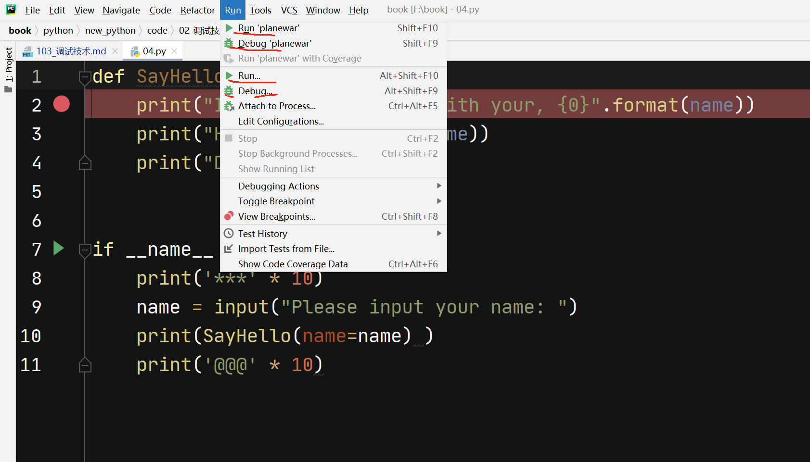
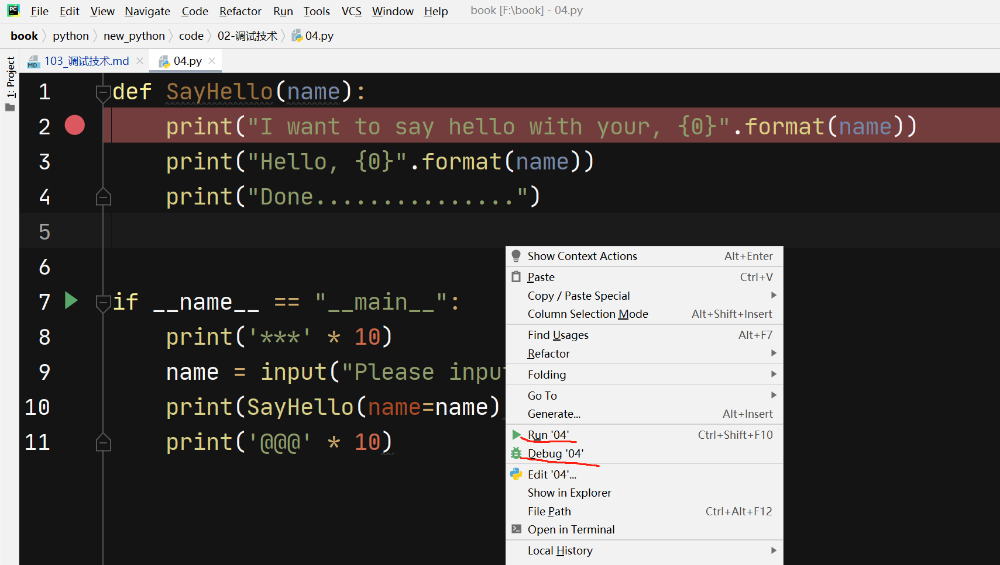
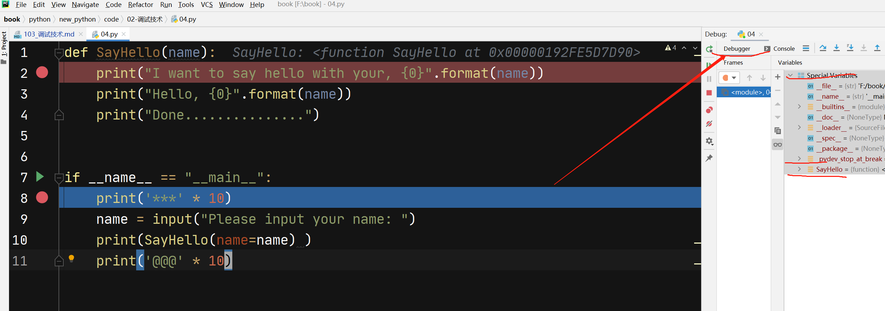
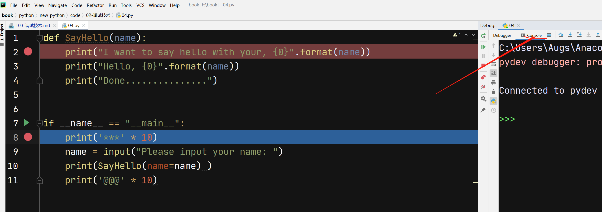
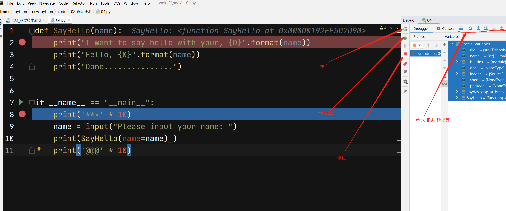

- 程序调试是将编制的程序投入实际运行前，用手工或编译程序等方法进行测试，修正语法错误和逻辑错误的过程。
- 这是保证计算机信息系统正确性的必不可少的步骤。
- 编完计算机程序，必须送入计算机中测试。根据测试时所发现的错误，进一步诊断，找出原因和具体的位置进行修正 
- 调试分类：
    - 静态调试：以看为主，看源代码，输出寄存器内容，输出变量值
    - 动态调试：程序运行中人为控制运行节奏和步骤
    
## 几个概念

- 断点(breakpoint): 程序中某一个位置,再调试模式(debug)下运行,程序执行到这个点就会停住,等待你下一步命令

- 调试模式(debug): 程序运行,遇到断点会挺住,方便交互式运行代码

- 运行模式(run): 程序正常执行命令,自动忽略断点

## pdb调试

`pdb`调试是应对的命令行样式的开发, 现在用处比较少, 再个别远程调试中或许还有用到,但很少遇到了.

了解`pdb`调试主要是了解调试的一些基础概念.

推荐文章
- [官方网页（英文)](https://docs.python.org/2/library/pdb.html)
- [pdb模块介绍](http://blog.csdn.net/carolzhang8406/article/details/6923997)
- [pdb调试技巧](https://www.ibm.com/developerworks/cn/linux/l-cn-pythondebugger/)
    
`pdb`调试启动方式分两种：

- 命令行启动

- 代码中加入调试包, 直接命令启动

### 命令行启动`pdb`

下面代码是被测代码:

    # 01.py, 这个名字起的很魔幻,请自动忽略
    a = "i love chian"
    b = "and you"

    print(a + b)

    c = 5
    print(a + c)

代码很简单,但我们需要一行一行运行代码,此时需要启动`pdb`调试, 则直接运行:

    python -m pdb 01.py
    
启动后会直接进入命令行,通过输入不同命令会执行不同的操作, 如果不清楚,可以通过帮助文档查看命令, 调试命令很少,参看下面:

    (base) F:\book\python\new_python\code\02-调试技术>python -m pdb 01.py
    > f:\book\python\new_python\code\02-调试技术\01.py(2)<module>()
    -> a = "i love chian"

其中, 打开程序后会显示一个箭头指向的内容,表明程序现在正准备执行这一行, 及下面的代码:

    -> a = "i love chian"

再输入帮助命令后,显示此调试支持的命令:

    (Pdb) help

    Documented commands (type help <topic>):
    ========================================
    EOF    c          d        h         list      q        rv       undisplay
    a      cl         debug    help      ll        quit     s        unt
    alias  clear      disable  ignore    longlist  r        source   until
    args   commands   display  interact  n         restart  step     up
    b      condition  down     j         next      return   tbreak   w
    break  cont       enable   jump      p         retval   u        whatis
    bt     continue   exit     l         pp        run      unalias  where

    Miscellaneous help topics:
    ==========================
    exec  pdb

    (Pdb)

下面根据不同的意图就可以进入不同的操作, 但上面的操作命令可能并不清晰,比如我想知道`c`代表什么意思, 可以继续借助帮助:

    (Pdb) help c
    c(ont(inue))
            Continue execution, only stop when a breakpoint is encountered.
    (Pdb)

上面解释了`c`命令就是`continue`的缩写,所以我们如果想让程序继续执行,知道遇到断点,直接敲入`c`命令即可:

    (Pdb) c
    i love chianand you
    Traceback (most recent call last):
      File "C:\Users\Augs\Anaconda3\lib\pdb.py", line 1667, in main
        pdb._runscript(mainpyfile)
      File "C:\Users\Augs\Anaconda3\lib\pdb.py", line 1548, in _runscript
        self.run(statement)
      File "C:\Users\Augs\Anaconda3\lib\bdb.py", line 434, in run
        exec(cmd, globals, locals)
      File "<string>", line 1, in <module>
      File "f:\book\python\new_python\code\02-调试技术\01.py", line 2, in <module>
        a = "i love chian"
    TypeError: must be str, not int
    Uncaught exception. Entering post mortem debugging
    Running 'cont' or 'step' will restart the program
    > f:\book\python\new_python\code\02-调试技术\01.py(2)<module>()
    -> a = "i love chian"
    (Pdb)

敲入继续命令后, 则继续执行知道程序末尾(因为没设置端点), 最后会打印出相应错误信息,并告诉你可以通过`cont`或者`step`命令重启调试.

### 代码启动`pdb`
        
如果想经常调试,可以再代码中直接写入调试命令,下面代码则是直接把调试模块导入后执行:

    # 文件名  02.py
    # 导入调试后设置
    import pdb
    pdb.set_trace()
    a = "i love chian"
    b = "and you"

    print(a + b)

    c = 5
    print(a)
                
对于这类文件, 调试的时候直接运行即可, 使用下面代码:

    python 02.py
    
剩下的跟上面打开方式的调试一致.

### `pdb`调试案例

参看下面代码:

    import pdb
    pdb.set_trace()
    def func(n):
        for i in range(1,n):
            print("LOOP {0} ".format(i))

        print("Func is done!!!")

    if __name__ == "__main__":
        print("Start my software..........")
        func(10)
        print("Software is done !!!!!!!!")
        
上面代码很简单,我们用`pdb`主要展示常用几个命令即可,其中`#`后内容我大拿加的注释, 原来并没有:

    (base) F:\book\python\new_python\code\02-调试技术>python 03.py
    > f:\book\python\new_python\code\02-调试技术\03.py(3)<module>() #启动
    -> def func(n):
    (Pdb) l #浏览代码
      1     import pdb
      2     pdb.set_trace()
      3  -> def func(n): #表示当前运行的行
      4         for i in range(1,n):
      5             print("LOOP {0} ".format(i))
      6
      7         print("Func is done!!!")
      8
      9     if __name__ == "__main__":
     10         print("Start my software..........")
     11         func(10)
    (Pdb) b 5 #在第五行上设置断点
    Breakpoint 1 at f:\book\python\new_python\code\02-调试技术\03.py:5
    (Pdb) c #运行到断点处
    Start my software..........
    > f:\book\python\new_python\code\02-调试技术\03.py(5)func()
    -> print("LOOP {0} ".format(i))
    (Pdb) c #运行到下一个断点处
    LOOP 1 #显示这事第一次循环
    > f:\book\python\new_python\code\02-调试技术\03.py(5)func()
    -> print("LOOP {0} ".format(i))
    (Pdb) c
    LOOP 2
    > f:\book\python\new_python\code\02-调试技术\03.py(5)func()
    -> print("LOOP {0} ".format(i))
    (Pdb) clear #清除所有断点
    Clear all breaks? y
    Deleted breakpoint 1 at f:\book\python\new_python\code\02-调试技术\03.py:5
    (Pdb) l
      1     import pdb
      2     pdb.set_trace()
      3     def func(n):
      4         for i in range(1,n):
      5  ->         print("LOOP {0} ".format(i))
      6
      7         print("Func is done!!!")
      8
      9     if __name__ == "__main__":
     10         print("Start my software..........")
     11         func(10)
    (Pdb) n 1
    LOOP 3
    > f:\book\python\new_python\code\02-调试技术\03.py(4)func()
    -> for i in range(1,n):
    (Pdb) c
    LOOP 4
    LOOP 5
    LOOP 6
    LOOP 7
    LOOP 8
    LOOP 9
    Func is done!!!
    Software is done !!!!!!!!

        
## pycharm调试

`Pycharm`只是一个工具, 调试的目的跟`pdb`一致,所以, 用法上除了这是一个图形用户界面的产品, 跟命令行调试本质上一致.

- 运行分为 `run/debug`模式, 菜单`run`下面有相关按钮, 并配有相应快捷键

### 案例

调试以下代码:

    def SayHello(name):
        print("I want to say hello with your, {0}".format(name))
        print("Hello, {0}".format(name))
        print("Done...............")

    if __name__ == "__main__":
        print('***' * 10)
        name = input("Please input your name: ")
        print(SayHello(name=name) )
        print('@@@' * 10)

运行和调试的区别我们已经了解了, 再`pycharm`中分别可以执行:

可以使用菜单运行调试:

也可以右键后直接启动:

鼠标点红色点那个竖条会自动设置断点:

右侧是快捷按钮:

