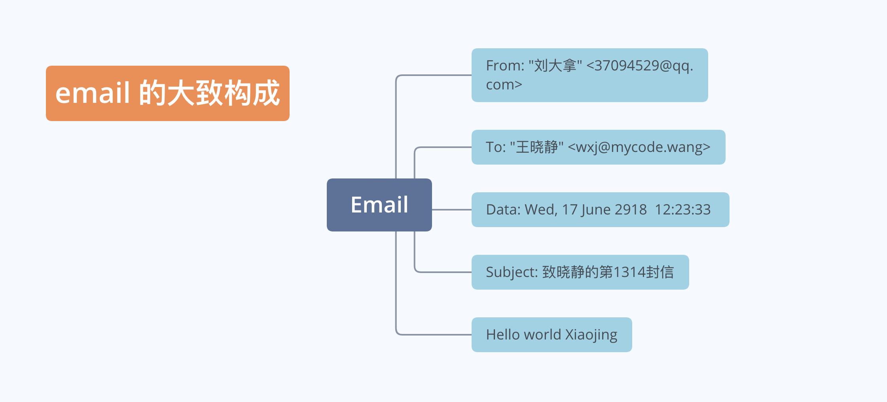
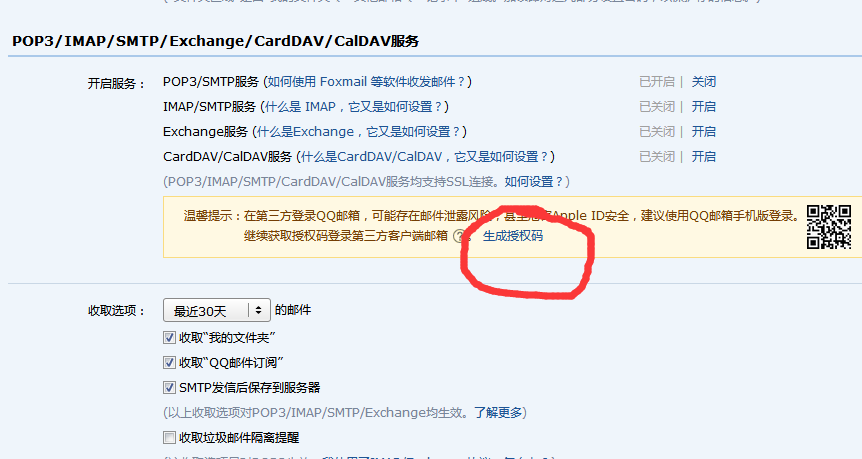

# 利用 Python 发送 Email

本章主要讲述邮件的收发原理和如何利用 Python 代码收发邮件。

Python 相关的电子邮件的模块和工具可以乐队官方的文档：
[Email 相关官方文档](https://docs.python.org/3/library/email.mime.html)

## 电子邮件的历史

- 1969 Leonard K. 教授发给同事的"LO"被认为是电子邮件的鼻祖
- 1971 美国国防部资助的阿帕网（Arpanet)的通讯机制里开始尝试通过网络发送信息
- 通讯地址里用@（读作艾特），是因为这个符号比较生僻，不会出现在正常的名称中，用来表示电子邮件的符号
- 1987 年中国第一封电子邮件发出，内容是

    "Across the Great Wall we can reach every corner in the world"

## 邮件管理程序

电子邮件中的管理邮件负责让人们更方便的管理/编写/使用邮件。

- Euroda 使邮件飞入寻常百姓家，让 Email 得以大规模普及
- Netscape、Outlook、Foxmail 后来居上，实现现在非常流行的电子邮件管理工具
- Hotmail 使用浏览器也可以收发邮件，对于 email 轻度使用者，可以摆脱专门的管理程序

## 邮件工作流程

先来了解几个关于电子邮件的概念：

- MUA（Mail User Agent）：
    - 接收邮件所使用的邮件客户端，使用 IMAP 或 POP3 协议与服务器通信
    - 常用的 MUA 有：outlook、thunderbird、Mac Mail、mutt；

- MTA（Mail Transfer Agent）：
    - 通过 SMTP 协议发送、转发邮件，是服务器与服务器直接发送，跟一般使用者无关
    - 常用的 MTA 服务有：sendmail、postfix；

- MDA（Mail Deliver Agent）：
    - 将 MTA 接收到的邮件保存到磁盘或指定地方，通常会进行垃圾邮件及病毒扫描
    - 常用的 MDA 有：procmail、dropmail；

- MRA（Mail Receive Agent）：
    - 负责实现 IMAP 与 POP3 协议，与 MUA 进行交互
    - 常用的 MRA 有：dovecot。

- SMTP（Simple Mail Transfer Protocol）：传输发送邮件所使用的标准协议

- IMAP（Internet Message Access Protocol）：接收邮件使用的标准协议之一

- POP3（Post Office Protocol 3）：接收邮件使用的标准协议之一

发送邮件的一个大概流程如下图所示：

MUA（Outlook/Foxmail）-> MTA -> ... ... MTA -> MDA -> MRA -> MUA（Outlook/Foxmail）

假定由我的 QQ 邮箱（3794529@qq.com）向麦扣网的王晓静同学（wxj@mycode.wang）发送一封电子邮件，整个流程大概是这样：

1. 大拿同学用 Outlook 写一封信，此时 Outlook 就是 MUA
2. 点击发送，这个过程是 MUA -> MTA，邮件已经在服务器上了
3. qq MTA -> ... ... -> MyCode MTA，邮件在麦扣网的电子邮件服务器上
4. MaCode MTA -> MaCode MDA，此时邮件已经在你的邮箱里了
5. MyCode MDA -> MUA（Foxmail/Outlook），邮件下载到本地电脑

## 发送一封邮件

如果利用代码发送邮件，邮件可以看作是一个 Object，我们需要做的就是登录邮箱后把这个 Object 按照制定格式发送出去。

在这个邮件的 Object 里，我们观察一下大概有几个内容：



一个邮件里有标题、副标题、发件人、收件人、内容等组成。如果简单化，内容比较重要。收件人发件人等可能就是一个字符串。

邮件的内容是一个独立的 Object，这个 Object 一般是一个 MIMEBase 的子类的示例，很少直接使用 MIMEBase，如果一个邮件内容包含的内容不是一类内容，比如包含图片和文字等，我们需要构建一个 MIMEMultipart 类的实例，除此以外一般的 MIMEText 等就可以。

邮件内容对应的类型结构如下图所示：


- 准备工作
    - 注册邮箱（以 qq 邮箱为例）
    - 第三方邮箱需要特殊设置，以 qq 邮箱为例
        - 进入设置中心
        - 取得授权码
    - 整个过程如下图所示：
        
        

- 编写程序过程
    1. 发送：MUA -> MTA with SMTP：Simple Mail Transfer Protocol，包含 MTA -> MTA
    2. 接受：MDA -> MUA with POP3 and IMAP：Post Office Protocol v3 and Internet Message Access Protocol v4

需要注意的是：

- 发送邮件需要导入 smtplib 和相应的邮件内容的类型
- 现在邮箱绝大部分都使用 https 协议，协议端口和使用的发送函数都发生了变换，具体参看源代码。

### 构建纯文本邮件

```python
# 导入相应的包
import smtplib
from email.mime.text import MIMEText
# MIMEText三个主要参数
# 1. 邮件内容
# 2. MIME子类型，在此案例我们用plain表示text类型
# 3. 邮件编码格式

msg = MIMEText("Hello, i am xxxx ", "plain", "utf-8")

# 发送email地址，此处地址直接使用我的qq有偶像，密码一般需要临时输入，此处偷懒
from_addr = "3794529@qq.com"
# 此处密码是经过申请设置后的授权码，不是不是不是你的qq邮箱密码
from_pwd = "hjpovygc********"

# 收件人信息
# 此处使用qq邮箱，我给自己发送
to_addr = "wxj@mycode.wang"


# 输入SMTP服务器地址
# 此处根据不同的邮件服务商有不同的值，
# 现在基本任何一家邮件服务商，如果采用第三方收发邮件，都需要开启授权选项
# 腾讯qq邮箱所的smtp地址是 smtp.qq.com

smtp_srv = "smtp.qq.com"

try:
    # qq邮箱使用加密协议，端口465
    srv = smtplib.SMTP_SSL(smtp_srv.encode(), 465) #SMTP协议默认端口25
    #登录邮箱发送
    srv.login(from_addr, from_pwd)
    # 发送邮件
    # 三个参数
    # 1. 发送地址
    # 2. 接受地址，必须是list形式
    # 3. 发送内容，作为字符串发送
    srv.sendmail(from_addr, [to_addr], msg.as_string())
    srv.quit()
except Exception as e:
    print(e)
```

### 发送 HTML 格式的邮件

相对来讲 HTML 内容的邮件可能会比较漂亮，样式丰富，也是我们常用的一种发送邮件的格式。

- 准备 HTML 代码作为邮件内容
- 把邮件是 subtype 修改为 html

代码跟 text 邮件发送基本一致，请参加源码：

```python
from email.mime.text import MIMEText

mail_content = """
        <!DOCTYPE html>
        <html lang="en">
        <head>
            <meta charset="UTF-8">
            <title>Title</title>
        </head>
        <body>

        <h1> 这是一封HTML格式邮件</h1>

        </body>
        </html>
        """

msg = MIMEText(mail_content, "html", "utf-8")

# 构建发送者地址和登录信息
from_addr = "1366798119@qq.com"
from_pwd = "hjpovygcx*******"


# 构建邮件接受者信息
to_addr = "1366798119@qq.com"

smtp_srv = "smtp.qq.com"


try:
    import smtplib

    srv = smtplib.SMTP_SSL(smtp_srv.encode(), 465)

    srv.login(from_addr, from_pwd)
    srv.sendmail(from_addr, [to_addr], msg.as_string())
    srv.quit()

except Exception as e:
    print(e)
```

### 发送 HTML 和 Text 两种格式邮件

我们的邮件可以优先使用 HTML 格式的，毕竟漂亮才是第一生产力，但有时候网络毕竟差，为了适应这种情况，邮件还可以采用 Text 格式，这样如果接收端网络比较差的时候可以切换到 Text。

这种情况需要创建一个 MIMEMultipart 的实例，分别写两个邮件内容，再 attach 给 MIMEMultipart 的实例就可以。

```python
from email.mime.text import MIMEText
from email.mime.multipart import MIMEMultipart

# 构建一个MIMEMultipart邮件
msg = MIMEMultipart("alternative")

# 构建一个HTML邮件内容
html_content = """
            <!DOCTYPE html>
            <html lang="en">
            <head>
                <meta charset="UTF-8">
                <title>Title</title>
            </head>
            <body>

            <h1> 这是一封HTML格式邮件</h1>

            </body>
            </html>
        """
#
msg_html = MIMEText(html_content, "html", "utf-8")
#注意需要把构建的内容attach给MIMEMultipart类型的实例
msg.attach(msg_html)


msg_text = MIMEText("just text content", "plain", "utf-8")
msg.attach(msg_text)


# 发送email地址，此处地址直接使用我的qq邮箱，密码临时输入
from_addr = "3794529@qq.com"
#from_pwd = input('邮箱密码: ')
from_pwd = "hjpovyg*********"

# 收件人信息:
to_addr = "1366798119@qq.com"

# 输入SMTP服务器地址:
# 此地址根据每隔邮件服务商有不同的值,这个是发信邮件服务商的smtp地址
# 我用的是qq邮箱发送，此处应该填写腾讯qq邮箱的smtp值,即smtp.163.com,
# 需要开启授权码，
smtp_srv = "smtp.qq.com"

try:
    import smtplib
    # 加密传输
    #server = smtplib.SMTP_SSL(smtp_srv.encode(), 465) # SMTP协议默认端口是25
    # qq邮箱要求使用 TLS加密传输
    server = smtplib.SMTP(smtp_srv.encode(), 25) # SMTP协议默认端口是25
    server.starttls()
    # 设置调试级别
    # 通过设置调试等级，可以清楚的看到发送邮件的交互步骤
    server.set_debuglevel(1)
    # 登录发送邮箱
    server.login(from_addr, from_pwd)
    server.sendmail(from_addr, [to_addr], msg.as_string())
    server.quit()
except Exception as e:
    print(e)
```

### 带附件的邮件

- 看做是一个文本邮件和一个附件的合体
- 一封邮件如果涉及到多个部分，需要使用 MIMEMultipart 格式构建
- 添加一个 MIMEText 正文
- 添加一个 MIMEBase 或者 MEMEText 作为附件

```python
from email.mime.text import MIMEText #构建附件使用
from email.mime.multipart import MIMEBase, MIMEMultipart # 构建基础邮件使用


mail_mul = MIMEMultipart()
# 构建邮件正文
mail_text = MIMEText("Hello, i am 刘大拿", "plain", "utf-8")
# 把构建好的邮件正文附加入邮件中
mail_mul.attach(mail_text)

# 构建附加
# 构建附件，需要从本地读入附件
# 打开一个本地文件
# 以rb格式打开
with open("02.html", "rb") as f:
    s = f.read()
    # 设置附件的MIME和文件名
    m = MIMEText(s, 'base64', "utf-8")
    m["Content-Type"] = "application/octet-stream"
    # 需要注意，
    # 1. attachment后分好为英文状态
    # 2. filename 后面需要用引号包裹，注意与外面引号错开
    m["Content-Disposition"] = "attachment; filename='02.html'"
    # 添加到MIMEMultipart
    mail_mul.attach(m)


# 发送email地址，此处地址直接使用我的qq有偶像，密码一般需要临时输入，此处偷懒
from_addr = "1366798119@qq.com"
# 此处密码是经过申请设置后的授权码，不是不是不是你的qq邮箱密码
from_pwd = "hjpovygcxv*******"

# 收件人信息
# 此处使用qq邮箱，我给自己发送
to_addr = "1366798119@qq.com"


# 输入SMTP服务器地址
# 此处根据不同的邮件服务商有不同的值，
# 现在基本任何一家邮件服务商，如果采用第三方收发邮件，都需要开启授权选项
# 腾讯qq邮箱所的smtp地址是 smtp.qq.com

smtp_srv = "smtp.qq.com"

try:
    import smtplib
    srv = smtplib.SMTP_SSL(smtp_srv.encode(), 465) #SMTP协议默认端口25
    #登录邮箱发送
    srv.login(from_addr, from_pwd)
    # 发送邮件
    # 三个参数
    # 1. 发送地址
    # 2. 接受地址，必须是list形式
    # 3. 发送内容，作为字符串发送
    srv.sendmail(from_addr, [to_addr], mail_mul.as_string())
    srv.quit()
except Exception as e:
    print(e)
```

### 发送邮件的其他问题

有时候发送邮件需要对邮件头等信息仔细的定制下，例如我想让对方看到我的信息是 `刘大拿<3794529@qq.com>`，此时需要 Header 来构建邮件头。

其他对邮件的发送、接受、标题等的配置请参见源码。

```python
from email.mime.text import MIMEText
# 用来构建邮件头`
from email.header import Header

msg = MIMEText("Hello wold", "plain", "utf-8")
# 下面代码故意写错，说明，所谓的发送者的地址，只是从一个Header的第一个参数作为字符串构建的内容
# 用utf8编码是因为很可能内容包含非英文字符
header_from = Header("从刘大拿邮箱发出去的<3794529@qq.cn>", "utf-8")
msg['From'] = header_from

# 填写接受者信息
header_to = Header("麦扣网的王晓静<wxj@mycode.wang>", 'utf-8')
msg['To'] = header_to

header_sub = Header("北京图灵学院的主题", 'utf-8')
msg['Subject'] = header_sub


# 构建发送者地址和登录信息
from_addr = "1366798119@qq.com"
from_pwd = "hjpovyg*********"


# 构建邮件接受者信息
to_addr = "1366798119@qq.com"

smtp_srv = "smtp.qq.com"


try:
    import smtplib

    srv = smtplib.SMTP_SSL(smtp_srv.encode(), 465)

    srv.login(from_addr, from_pwd)
    srv.sendmail(from_addr, [to_addr], msg.as_string())
    srv.quit()

except Exception as e:
    print(e)
```

## 接收邮件

接收邮件相对比较简单，跟对方的邮件构建等没有直接相关性。

- 本质上是 MDA 到 MUA 的一个过程
- 从 MDA 下载下来的是一个完整的邮件结构体，需要解析才能得到每个具体可读的内容
- 解析步骤：
    1. 用 poplib 下载邮件结构体原始内容
        1. 准备相应的内容
        2. 身份认证
        3. 一般会先得到邮箱内邮件的整体列表
        4. 根据相应序号，得到某一封信的数据流
        5. 利用解析函数进行解析出相应的邮件结构体
    2. 用 email 解析邮件的具体内容


