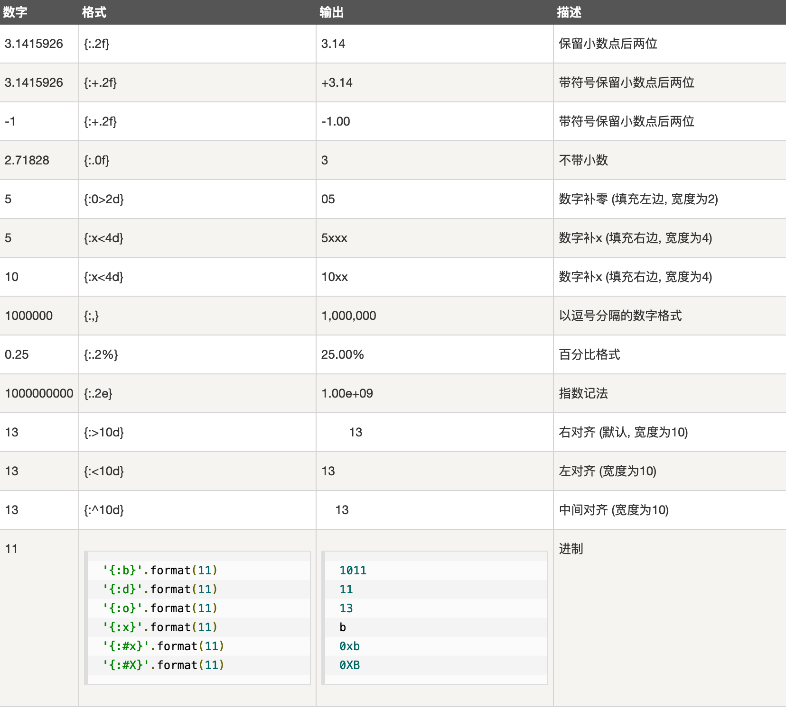

字符串通常用来表示文字信息

 字符串定义有四种方式，分别是：

-  单引号
    
        slogan = '我爱王晓静'
        print(slogan)
        输出：
           我爱王晓静 
- 双引号, 跟单引号效果完全一样

        slogan = "我是北京图灵学院的刘大拿"
        print(slogan)
        输出：
            我是北京图灵学院的刘大拿

- 三单引号, 跟单双引号不同的是，它的字符串可以有换行，输出结果也是自动换行

        a = '''我是刘大拿，
                我们的学校叫北京图灵学院，
                我们的校训是：我爱王晓静
                '''
        print(a)
        结果：
            我是刘大拿，
            我们的学校叫北京图灵学院，
            我们的校训是：我爱王晓静
- 三双引号， 作用和意义跟三个单引号一致


## 转义字符

在字符串中，有些字符因为特殊的作用，直接表示出来不太方便，常见的比如引号，我们把引号作为字符串的边界
符号，这时候字符串中如果出现引号就可能造成错误，另外，在我们的文本中也常出现一些不容易表示的符号，比如：换行符号，此类符号我们用一种特殊的方法表示出来，通常称为转义。

转义一般利用反斜杠表示，借助反斜杠字符，一旦字符串中出现反斜杠，则反斜杠后面所表示的字符表示已经不是原来的意思了，进行了转义

> 在字符串中，一旦出现反斜杠就要加倍小心，可能有转义字符出现
>
- 常见的转义字符有回车换行，空格，制表符等
- 不同系统对换行操作符有不同的表示, 常见的例子是换行符号, win系统和linux系统表示不一致，文本操作类程序需要特别注意：
    - windows： 用`\r\n`来表示换行符号
    - Linux:  用`\n`来表示换行符号
- 常见转义字符表：

        转义字符	描述
        \(在行尾时)	续行符	
        \\	        反斜杠符号  	
        \'	        单引号		
        \"	        双引号		
        \a	        响铃
        \b	        退格(Backspace)
        \e	        转义
        \000	    空符号
        \n	        换行			
        \v	        纵向制表符
        \t	        横向制表符	
        \r	        回车			
        \f	        换页
        \oyy	    八进制数，yy代表的字符，例如：\o12代表换行
        \xyy	    十六进制数，yy代表的字符，例如：\x0a代表换行
        \other		其它的字符以普通格式输出

 下面炒几个栗子：
 
```python
        # 把我们的校训放入ｓ中，ｓ就是个字符串变量
        s = "i love lixiaojing"
        print(s)
```
  
  运行结果：
  
       i love lixiaojing

另一个比较长的栗子：

```python
        #  如果想表示出Let‘s go来
        # 1. 可以使用嵌套引号，即外层使用双引号
        # 2. 转义字符
        s = "Let's go"
        print(s)

        # 时候用转义， \' == '
        ss = 'Let\'s go'
        print(ss)

        # 使用了转义，  \\ == \
        sss = "c:\\user"
        print(sss)

        # 回车换行符需要转义, 注意这个在win下会有结果，linux可能不是这个结果
        s1 = "I love \r\n wangixoajing"
        print(s1)
 ```
运行的结果是： 

        Let's go
        Let's go
        c:\user
        I love 
         wangixoajing


## 字符串的格式化

字符串的格式化就是把字符串按照一定格式进行打印或者填充。　

- 格式化有三种方法
    - 利用百分号（%）
    - 利用format函数
    - f-formatting

## 利用百分号格式化
- 在字符串中，利用%表示一个特殊的含义，表示对字符进行格式化
- %d: 此处应该放入一个整数， 即整数占位符号
- %s: 表示此处应该放入一个字符串， 即字符串占位符号

照例炒几个栗子：


```python
s = "I love %s"
# 下面打印，直接把%s作为字符串的一个内容打印出来
print(s)
```

因为我们只是占位了，但没有内容对占的位置进行填充，此时系统把`%s`理解成普通字符串，所以运行结果是：

    I love %s

填充的栗子：

```python
# 以下字符串打印出我们的校训
print("I love %s"%"wangxiaojing")
```

占位符被后面的字符串填充了，所以结果是：

    I love wangxiaojing

如果`s`是一个定义好的具有格式化占位符的字符串，可以先定义再填充：


```python
s = "I love %s"
print( s%"wangxiaojing")
```

`s`已经定义好了，所以下面的结果是酱婶儿滴：

    I love wangxiaojing

占位符很多，除了字符串占位符，整数也是可以的：

```python
s = "I am %d years old"
# 留意下面两句话的区别和结果
print(s)
print(s%18)
```

打印两个结果，一个被填充一个没被填充，则直接把占位符当做字符串处理：

    I am %d years old
    I am 18 years old


填充还可以是多个，随便举个栗子：

```python
s = "I am %s, i am %d years old"
print(s)
# 注意以下表达的出错原因
# 如果字符串中有占位符，则有几个占位符必须用几个实际内容代替，或者一个也不要
print(s%"tulingxueyuan")

# 如果出现多个占位符，则相应内容需要用括号括起来
print(s%("tulingxueyuan", 18))
```

多个占位符的填充，如果一个都不填充，则所有占位符都被当做普通字符串处理，如果要填充，则填充
的数量个占位符数量必须匹配，否则会出现以下的报错：

    I am %s, i am %d years old


    ---------------------------------------------------------------------------

    TypeError                                 Traceback (most recent call last)

    <ipython-input-11-c0600bb0a251> in <module>()
          3 # 注意以下表达的出错原因
          4 # 如果字符串中有占位符，则有几个占位符必须用几个实际内容代替，或者一个也不要
    ----> 5 print(s%"tulingxueyuan")
          6 
          7 # 如果出现多个占位符，则相应内容需要用括号括起来


    TypeError: not enough arguments for format string
    
以上错误是填充的个数和占位符的个数不匹配造成的。

>占位符的长度还可以自行定义，有需要的小伙伴儿可以自行百度。
>

## format函数格式化字符串

利用`%`格式化是一个古老的方式，现在基本不再提倡， 通常Python会使用`format`函数来进行格式化，函数的
概念虽然还没有介绍，这里还是要先给大家做一个介绍。

`format`函数格式化在使用上，以{}代替%号，后面用format带参数完成对字符串的填充。

听过很多道理，但依然过不好我们这一生，还是炒几个栗子来的实惠：

```python
# 注意字符串直接用大括号空出来，后面的format函数和字符串中间有个点好，format后面有小括号
s = "I love {}".format("LiXiaojing")
print(s)

```

 运行结果就是我们的校训：
 
    I love LiXiaojing

`foremat`格式化的大括号可以有很多个，一样的道理，后面相应的数据也必须和前面大括号个数一致才行，
如果不一致则报错。

多个数据进行格式化，是按照后面的填充的数据进行按顺序填充的，所以一般不需要在大括号内填写序号。

但是， format的一个好处是，如果有必要，可以对需要填充的顺序进行编号，后面内容根据编号自行替换。

例如下面的例子，不但顺序进行了变更，数量同样也不一样，但因为已经对需要填充的位置进行了顺序编号，
虽然三个位置，但两个编号为`1`的大括号，所以依然不会报错：

```python
s = "Yes, i am {1} years old, I love {0} and i am {1} years old".format("Tulingxueyuan", 18)
print(s)
```

`format`可以使用命名参数进行格式，即对每个需要填充的内容进行命名，对相应的名称作为变量赋值(参加函数章节的关键字参数)。

关键字参数例子如下：

```python
# 本例中相当于每个大括号中有一个变量，变量的值在后面format中给出
s = "Yes, i am {age} years old, I love {name} and i am {age} years old".format(name="Tulingxueyuan", age=18)
print(s)
```

运行结果如下：

    Yes, i am 18 years old, I love Tulingxueyuan and i am 18 years old

## f-字符串格式化

f-字符串格式化是Python3.6添加的新功能，相对比`format`等方便一些。

在字符串开头使用`f`或者`F`，然后字符串中留下相应的变量名，则Python会根据变量名称自动填充，当然前提是你得有这个变量。

```python
name = "刘大拿"
age = 19
height = 184

# f字符串直接使用前面定义的变量填充， 方便的一匹
print(f"我叫{name}, 今年{age}, 我高{height}")
```

运行结果如下：

    我叫刘大拿, 今年19, 我高184
    
f格式化中，还可以使用字典等进行填充，同时使用更精细的格式控制字符，功能比前两种强悍：

下面的例子定义一个字典，直接使用字典的内容进行填充，同时使用了格式控制符对输出格式进行了精确控制。
> 格式化的格式控制符，在每种格式化中都有，只是用的比较少，我们不过多的介绍
>


```python

dana  = {"name":"刘大拿", "age":19, "wifi":"王晓静"}

#变量可以是字典呀
print(f"我叫{dana['name']}, 今年{dana['age']: .2f}, 人生苦短，I need {dana['wifi']}")
```
运行结果如下：

    我叫刘大拿, 今年 19.00, 人生苦短，I need 王晓静
    
    
## 字符串的控制格式输出

有时候字符串输出需要精细控制格式，比如输出字符串需要占用固定宽度等，下面分别介绍：

### `%`控制格式
1. 指定最小输出宽度：此时格式为 `%ns`, `n`为字符串`s`所占的最小宽度

        n = 1234567
        print("n(10):%10d." % n) #n最小占10个宽度 
        print("n(5):%5d." % n)

        url = "http://c.biancheng.net/python/"
        print("url(35):%35s." % url)
        print("url(20):%20s." % url)
 
2. 左右对齐用符号控制
    - `-`: 指定左对齐
    - `+`: 表示输出的数字总要带着符号；正数带+，负数带-。
    - `0`: 宽度不足时补充 0，而不是补充空格。
    
    其中：
    1. 对于整数，指定左对齐时，在右边补 0 是没有效果的，因为这样会改变整数的值。
    2. 对于小数，以上三个标志可以同时存在。
    3. 对于字符串，只能使用-标志，因为符号对于字符串没有意义，而补 0 会改变字符串的值。
    
            n = 123456
            # %09d 表示最小宽度为9，左边补0
            print("n(09):%09d" % n)
            # %+9d 表示最小宽度为9，带上符号
            print("n(+9):%+9d" % n)
            f = 140.5
            # %-+010f 表示最小宽度为10，左对齐，带上符号
            print("f(-+0):%-+010f" % f)
            s = "Hello"
            # %-10s 表示最小宽度为10，左对齐
            print("s(-10):%-10s." % s)

        运行结果如下：
    
            n(09):000123456
            n(+9):  +123456
            f(-+0):+140.500000
            s(-10):Hello   
3. 指定小数精度好用`%m.nf`或者`%.nf`表示

        f = 3.141592653
        # 最小宽度为8，小数点后保留3位
        print("%8.3f" % f)
        # 最小宽度为8，小数点后保留3位，左边补0
        print("%08.3f" % f)
        # 最小宽度为8，小数点后保留3位，左边补0，带符号
        print("%+08.3f" % f)
 
    运行结果如下：
        
          3.142
        0003.142
        +003.142
 
### `format`控制格式



1. `^, <, > `分别是居中、左对齐、右对齐，后面带宽度， `:` 号后面带填充的字符，只能是一个字符，不指定则默认是用空格填充。
2. `+` 表示在正数前显示 `+`，负数前显示 `-`；  （空格）表示在正数前加空格
3. `b、d、o、x` 分别是二进制、十进制、八进制、十六进制。

### `f-string`控制格式

`f`字符串的控制符号参考`format`控制符号即可。