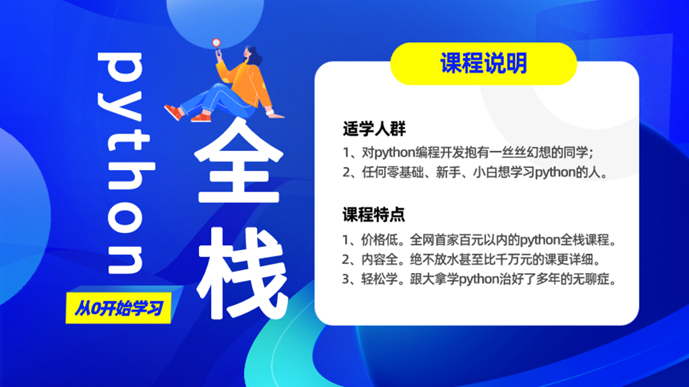
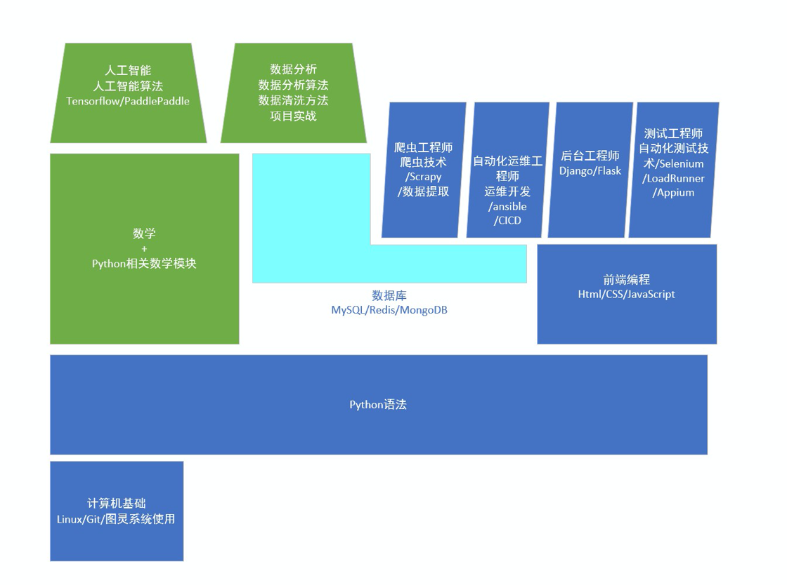

# 开学典礼-不讲知识

## 开课原因
- 打造一门讲解优秀，内容丰富，完整，详细的课程

    

## 北京图灵学院介绍
- 讲师：刘大拿
- 北京图灵学院的起源：
    1. 尝试利用互联网低成本的传播优势，降低培训行业结构性成本来颠覆现状
    2. 既然培训学校不喜欢我，我就自己开一个呗
- 我们兄弟七个
    - 刘大拿, 奥格斯堡大学软件硕士
    - 许老大, 奥格斯堡大学物理硕士, 数据分析专家
    - 梁博士, 凯撒斯劳滕大学数学博士, 金融风控专家
- 目标：
    1. 以免费模式为主，利用互联网的低成本高传播特性，打造一门牛掰的课程
    2. 课程免费，服务适当收费
    3. 普及python
- 本次课程目标：
    1. 2018初的免费python全栈开行业先河
    2. 2020年升级课程，瞄准小白用户，慢功夫，从0基础开始直到大牛全程守护
        - 面向小白
        - 毕业达到工作两年经验水准
        - 课程高质量
    3. 2022年, 录播反复学习, 直播答疑+鲜活展示, 对于网络乞讨者, 点赞很重要

## 课程体系
- Python领域的几大方向
    - 游戏
    - 后台+爬虫
    - 数据科学
    - AI
    - 自动化测试，自动化运维，自动化办公
- Python体系结构怎么学

    
- 如何选择
    - 学历: 985/211不要犹豫，直接数据科学+AI
    - 兴趣： 爬虫比较有趣，后台需求量大

## Python市场
-  python为什么火
    - 由需求引发的市场
    - 相对比较简单，面对中小企业和原PHP市场还有巨大需求
- 要不要学
    - Python是很好的教学课程，市场已经做出了选择
    - Python应用广泛，功能强悍
    - 与其做Java的牛尾，干嘛不做Python的鸡头

## 学习方法
- 齐心正义, 提高`师从性`: 
    - 动力源于相信，相信自己，相信老师
- 学习是系统工程，拒绝碎片知识，欲速则不达
    - 小课对于基础学员弊大于利，不能求速成
    - 慢就是快，Python就这点知识，吃透一个学下一个，很快
    - 学会搭建自己的知识体系,拒绝碎片知识
- 知识+习题， 知识点和习题相互促进，早日形成正向刺激
    - 正向刺激对每一个学习者都是学有所成的前提
    - Python属于实践性科学，需要大量练习辅助学习
    - 习题课中直接讲实战代码，补充附加知识
    - 报名习题课加微信13119144223或进qq群9990960找管理
    - 习题课专业答疑，24小时在线
- 好记性+烂笔头+勤能补拙=blog+git=终身学习=我学我用我输出
    - 跟老师一起学习，同时学习搭建自己的知识体系
    - 在未形成输出型知识前，不算真正掌握知识
    - 博客网站，Github, 注册并尝试发表内容
    - 知乎: 刘大拿
- qq群+微信=进入组织=QQ群9990960， 微信13119144223
- 提问的技巧
    - 有问题QQ群提问，微信群只吹水
    - 提问请贴图，不要发代码拷贝
- 笔记地址：
    - 红宝书教程网: http://www.baoshu.red
